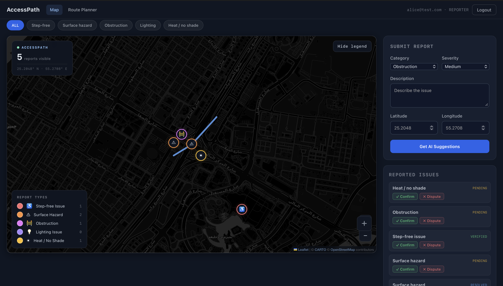
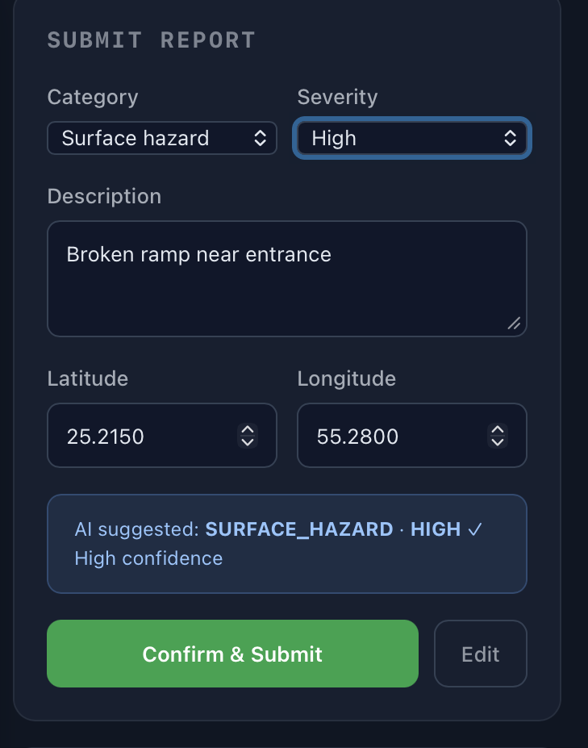
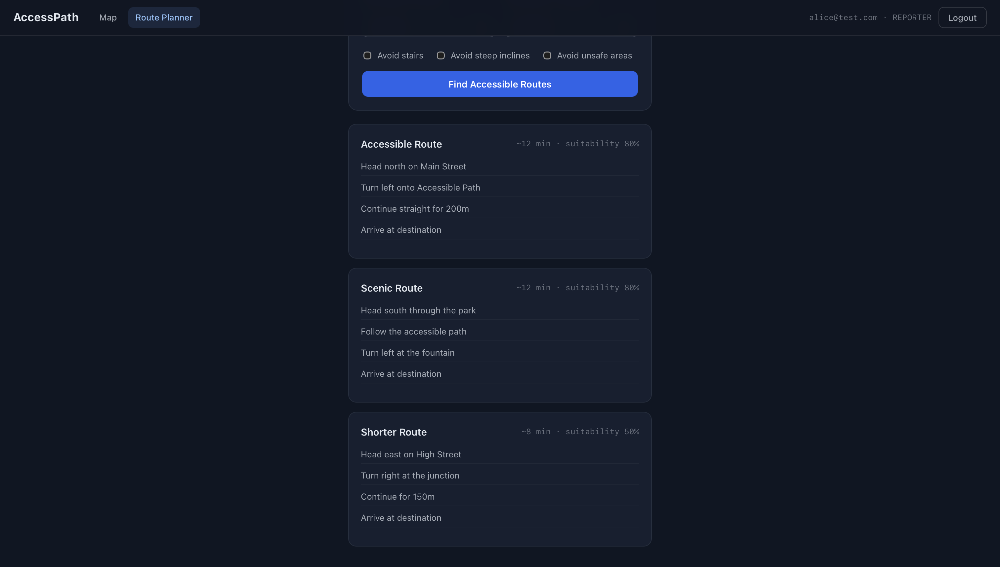
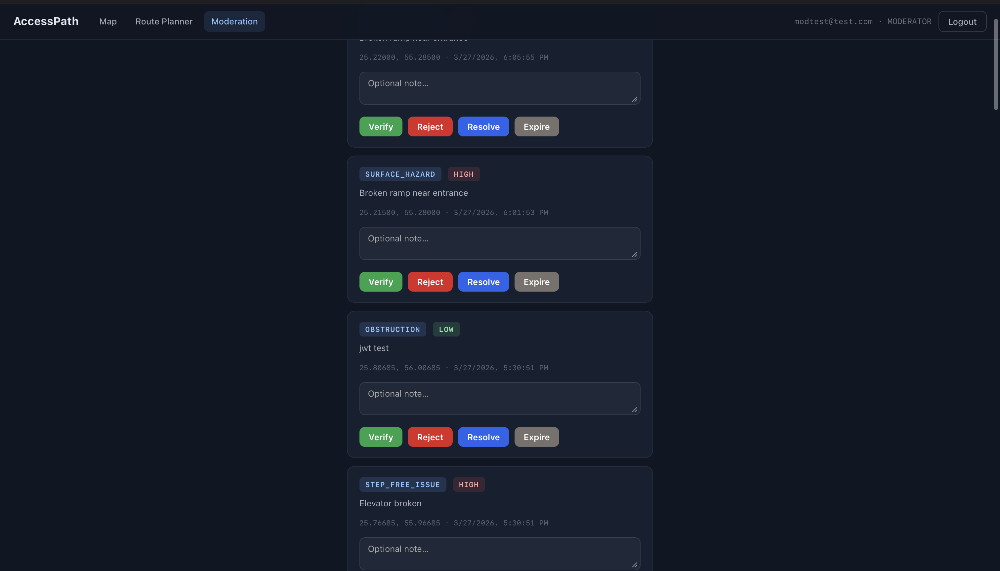

# AccessPath

A crowdsourced accessibility mapping and route-planning application built to support **SDG 11 — Sustainable Cities and Communities**. Users report accessibility barriers in their city (broken ramps, blocked paths, surface hazards, etc.), the community votes to confirm or dispute them, moderators review and verify reports, and the routing engine generates accessible walking routes that factor in live barrier data.

> **Milestone 4 evaluation poster:** open [`docs/poster.html`](docs/poster.html) in any browser (double-click the file, or run `open docs/poster.html` on macOS).

---

## Table of Contents

1. [Prerequisites](#1-prerequisites)
2. [Project Structure](#2-project-structure)
3. [Environment Variables](#3-environment-variables)
4. [Setup & Running Locally](#4-setup--running-locally)
   - 4.1 [Clone the repository](#41-clone-the-repository)
   - 4.2 [Configure environment variables](#42-configure-environment-variables)
   - 4.3 [Start the database (Docker)](#43-start-the-database-docker)
   - 4.4 [Run the backend](#44-run-the-backend)
   - 4.5 [Test accounts](#45-test-accounts)
   - 4.6 [Run the frontend](#46-run-the-frontend)
5. [Running Tests](#5-running-tests)
6. [API Overview](#6-api-overview)
7. [Screenshots](#7-screenshots)
8. [Tech Stack](#8-tech-stack)
9. [Evaluation Poster](#9-evaluation-poster)

---

## 1. Prerequisites

| Tool | Required Version | Notes |
|------|-----------------|-------|
| **Java (JDK)** | **17 exactly** | The project's `pom.xml` targets `java.version=17`. Java 21+ will cause compilation errors with the Lombok + Maven compiler combination used. Install via Homebrew: `brew install openjdk@17` |
| **Maven** | 3.8+ | Used to build and test the backend |
| **Node.js** | 18+ | Required by the Vite/React frontend |
| **npm** | 9+ | Bundled with Node.js 18+ |
| **Docker Desktop** | Any recent version | Runs the PostgreSQL + PostGIS database container |

> **Java version warning:** If your system has multiple JDKs, make sure `java -version` reports 17 before running any Maven commands. If it does not, set `JAVA_HOME` explicitly (we have done it using macOS only):
> ```bash
> # macOS (Homebrew)
> JAVA_HOME=$(/usr/libexec/java_home -v 17) mvn <goal>
>
> # Linux — path depends on your JDK install, e.g.:
> JAVA_HOME=/usr/lib/jvm/java-17-openjdk-amd64 mvn <goal>
> ```

---

## 2. Project Structure

```
AccessPath/
├── backend/                        # Spring Boot REST API (Java 17)
│   ├── src/
│   │   ├── main/
│   │   │   ├── java/com/accesspath/
│   │   │   │   ├── controllers/    # AuthController, ReportController,
│   │   │   │   │                   #   VoteController, ModerationController,
│   │   │   │   │                   #   RouteController
│   │   │   │   ├── services/       # Business logic layer
│   │   │   │   ├── models/         # JPA entities (User, Report, Vote,
│   │   │   │   │                   #   ModerationAction)
│   │   │   │   ├── dto/            # Request / response DTOs
│   │   │   │   ├── repositories/   # Spring Data JPA repositories
│   │   │   │   ├── security/       # JWT filter, JwtUtil, UserDetailsServiceImpl
│   │   │   │   ├── scheduler/      # ReportExpiryScheduler (auto-expiry job)
│   │   │   │   ├── validation/     # CoordinateValidator, ValidCoordinates
│   │   │   │   └── exceptions/     # GlobalExceptionHandler, custom exceptions
│   │   │   └── resources/
│   │   │       ├── application.properties
│   │   │       └── db/changelog/   # Liquibase migration changesets
│   │   │           ├── 001 — enable PostGIS extension
│   │   │           ├── 002 — users table
│   │   │           ├── 003 — reports table (with geography column)
│   │   │           ├── 004 — votes table
│   │   │           ├── 005 — moderation_actions table
│   │   │           ├── 006 — seed sample data
│   │   │           ├── 007 — seed additional reports
│   │   │           ├── 008 — seed test accounts (alice, bob, modtest)
│   │   │           └── 009 — standardise test account passwords
│   │   └── test/                   # JUnit 5 + Mockito unit tests
│   │       └── java/com/accesspath/
│   │           ├── controllers/    # @WebMvcTest controller slice tests
│   │           ├── services/       # Pure Mockito service tests
│   │           ├── security/       # JwtUtil, JwtFilter, UserDetailsService tests
│   │           ├── scheduler/      # ReportExpiryScheduler tests
│   │           ├── validation/     # CoordinateValidator tests
│   │           └── exceptions/     # GlobalExceptionHandler tests
│   └── pom.xml
│
├── frontend/                       # React 19 + TypeScript + Vite
│   ├── src/
│   │   ├── pages/                  # LoginPage, RegisterPage, MapPage,
│   │   │                           #   RoutePage, ModerationPage, NotFoundPage
│   │   ├── components/             # Reusable UI components
│   │   ├── services/               # Axios API client functions
│   │   ├── context/                # React context (auth state, etc.)
│   │   ├── hooks/                  # Custom React hooks
│   │   ├── types/                  # TypeScript type definitions
│   │   └── utils/                  # Utility helpers
│   ├── vite.config.ts              # Vite config — proxies /api → localhost:8080
│   └── package.json
│
├── docs/
│   ├── TEST_PLAN.md                # Full unit + integration test plan (232 tests)
│   ├── run_integration_tests.py    # Automated integration test runner (61 tests)
│   ├── poster.html                 # Milestone 4 reflective evaluation poster (A1, open in browser)
│   └── screenshots/                # Appendix evidence screenshots (A–K)
│
├── docker-compose.yml              # PostgreSQL 15 + PostGIS 3.3 container
├── .env                            # Environment variables (committed for assessors)
├── .env.example                    # Template showing required variables
└── README.md
```

---

## 3. Environment Variables

A `.env` file is committed to the repository with all values pre-filled. No manual setup is required — the project runs out of the box with these values.

| Variable | Value in `.env` | Description |
|----------|----------------|-------------|
| `DB_NAME` | `accesspath` | PostgreSQL database name |
| `DB_USER` | `accesspath_user` | PostgreSQL username |
| `DB_PASSWORD` | `accesspath_pass` | PostgreSQL password |
| `DB_HOST` | `localhost` | Database host |
| `DB_PORT` | `5432` | Database port |
| `JWT_SECRET` | *(see `.env`)* | JWT signing secret (64-char random string) |
| `JWT_EXPIRATION_MS` | `86400000` | Token lifetime in milliseconds (24 hours) |
| `BACKEND_PORT` | `8080` | Port the Spring Boot server listens on |
| `FRONTEND_PORT` | `5173` | Port the Vite dev server listens on |
| `FRONTEND_URL` | `http://localhost:5173` | CORS allowed origin for the backend |

> The `.env` file is read automatically by Docker Compose. For the backend (`mvn spring-boot:run`), export the variables into your shell first — see the run instructions in section 4.4. The frontend Vite dev server proxies all `/api` requests to `http://localhost:8080`.

---

## 4. Setup & Running Locally

### 4.1 Clone the repository

```bash
git clone <repository-url>
cd AccessPath
```

### 4.2 Configure environment variables

A `.env` file is already included in the repository with all values pre-filled (per the project brief, secrets are committed so the project can be run locally by assessors).

If for any reason it is missing, copy the template:

```bash
cp .env.example .env
# Then set JWT_SECRET to a random string of 32+ characters.
```

### 4.3 Start the database (Docker)

```bash
docker-compose up -d
```

This starts a **PostgreSQL 15 + PostGIS 3.3** container named `accesspath_db` on port `5432`.

Wait until the container is healthy before starting the backend:

```bash
docker-compose ps
# STATUS column should show "healthy" (not "starting")
```

To stop the database (data is persisted in a named Docker volume):

```bash
docker-compose down
```

To stop and wipe all data:

```bash
docker-compose down -v
```

### 4.4 Run the backend

> **Requires Java 17.** See the [Prerequisites](#1-prerequisites) section if `java -version` does not report 17.

First, export the environment variables from `.env` so Spring Boot can read them:

```bash
# Run from the AccessPath directory (where .env lives)
export $(grep -v '^#' .env | xargs)
```

Then start the backend:

```bash
cd backend

# Option A — if java -version already shows 17:
mvn spring-boot:run

# Option B — if your system defaults to a different JDK:
JAVA_HOME=$(/usr/libexec/java_home -v 17) mvn spring-boot:run
```

The backend starts at **http://localhost:8080**.

Liquibase will automatically run all database migrations (create tables, seed sample data) on first startup. Subsequent starts only apply new changesets.

> **Note on seed reports:** The expiry scheduler runs on startup and will mark any PENDING seed reports with a past `expires_at` date as EXPIRED. If the map shows fewer reports than expected, reset the database to get a clean state:
> ```bash
> # From the AccessPath directory
> docker-compose down -v
> docker-compose up -d
> # Then restart the backend — Liquibase will re-seed everything fresh
> ```

To verify the backend is running:

```bash
curl http://localhost:8080/api/auth/login \
  -X POST \
  -H "Content-Type: application/json" \
  -d '{"email":"test@test.com","password":"wrong"}'
# Expected: HTTP 401 {"message":"Invalid email or password"}
```

### 4.5 Test accounts

The following accounts are created automatically by Liquibase on first startup and can be used immediately for login and testing:

| Email | Password | Role | Notes |
|-------|----------|------|-------|
| `alice@test.com` | `Test1234!` | REPORTER | Submit reports, cast votes |
| `bob@test.com` | `Test1234!` | NAVIGATOR | Cast votes |
| `modtest@test.com` | `Test1234!` | MODERATOR | Access moderation queue and actions |

> The three seed users (`lina.navigator@accesspath.app`, `omar.reporter@accesspath.app`, `maya.moderator@accesspath.app`) are demo data only — their plaintext passwords were not recorded and they cannot be used to log in.

### 4.6 Run the frontend

```bash
cd frontend
npm install       # first time only — installs node_modules
npm run dev
```

The frontend dev server starts at **http://localhost:5173**.

All requests to `/api/*` are automatically proxied by Vite to `http://localhost:8080`, so no CORS configuration is needed during development.

To build a production bundle:

```bash
npm run build     # outputs to frontend/dist/
npm run preview   # serve the production build locally
```

---

## 5. Running Tests

### Backend unit tests

> **Requires Java 17.** Maven must compile with JDK 17.

```bash
cd backend

# Option A — if java -version already shows 17:
mvn test

# Option B — if your system defaults to a different JDK:
JAVA_HOME=$(/usr/libexec/java_home -v 17) mvn test
```

**Expected result:** `Tests run: 232, Failures: 0, Errors: 0`

Test coverage includes:

| Layer | Test Class | Tests |
|-------|-----------|-------|
| Service | `ReportServiceTest` | 12 |
| Service | `VerificationServiceTest` | 12 |
| Service | `ModerationServiceTest` | 15 |
| Service | `ConfidenceServiceTest` | 17 |
| Service | `ClassificationServiceTest` | 16 |
| Service | `RoutingServiceTest` | 14 |
| Service | `UserServiceTest` | 9 |
| Controller | `AuthControllerTest` | 19 |
| Controller | `ReportControllerTest` | 28 |
| Controller | `VoteControllerTest` | 10 |
| Controller | `ModerationControllerTest` | 16 |
| Controller | `RouteControllerTest` | 11 |
| Scheduler | `ReportExpirySchedulerTest` | 9 |
| Security | `JwtUtilTest` | 9 |
| Security | `JwtFilterTest` | 8 |
| Security | `UserDetailsServiceImplTest` | 5 |
| Validation | `CoordinateValidatorTest` | 20 |
| Exception | `GlobalExceptionHandlerTest` | 2 |
| **Total** | | **232** |

The full test plan is in [docs/TEST_PLAN.md](docs/TEST_PLAN.md).

### Clean build + test

```bash
cd backend
JAVA_HOME=$(/usr/libexec/java_home -v 17) mvn clean test
```

### Integration tests (backend API)

With the database and backend both running, execute all 61 integration tests automatically using the provided Python script (Python 3, no extra packages needed):

```bash
# From the AccessPath directory
python3 docs/run_integration_tests.py
```

Expected result: `RESULT: 61/61 PASS`

Full integration test documentation is in [docs/TEST_PLAN.md](docs/TEST_PLAN.md).

### Frontend

The frontend does not have automated tests. Manual testing is documented in [docs/TEST_PLAN.md — Section 6](docs/TEST_PLAN.md#6-frontend-manual-testing), covering 19 test cases across every page and UI state (login, register, map with markers, AI draft, duplicate warning, voting, moderation actions, route planning, access control, error states, category filter, marker popup). Screenshots are in [docs/screenshots/](docs/screenshots/) (Appendices L–AD).

---

## 6. API Overview

Base URL: `http://localhost:8080/api`

All endpoints that require authentication expect a `Bearer <token>` header, where the token is the JWT returned by `/auth/register` or `/auth/login`.

### Authentication

| Method | Endpoint | Auth | Description |
|--------|----------|------|-------------|
| POST | `/auth/register` | None | Register a new REPORTER or NAVIGATOR account |
| POST | `/auth/login` | None | Login and receive a JWT token |

### Reports

| Method | Endpoint | Auth | Description |
|--------|----------|------|-------------|
| POST | `/reports/draft` | None | Get AI-suggested category and severity for a description |
| POST | `/reports` | Required | Submit a new accessibility report |
| GET | `/reports/{reportId}` | None | Get a report by ID |
| GET | `/reports/nearby?lat=&lng=&radius=` | None | Find reports near a location |

### Votes

| Method | Endpoint | Auth | Description |
|--------|----------|------|-------------|
| POST | `/reports/{reportId}/votes` | Required | Cast a CONFIRM or DISPUTE vote on a report |

### Moderation

| Method | Endpoint | Auth (MODERATOR) | Description |
|--------|----------|-----------------|-------------|
| GET | `/moderation/queue` | Required | Get all PENDING reports |
| POST | `/moderation/{reportId}/verify` | Required | Mark report as VERIFIED |
| POST | `/moderation/{reportId}/reject` | Required | Reject a PENDING report |
| POST | `/moderation/{reportId}/resolve` | Required | Mark a VERIFIED report as RESOLVED |
| POST | `/moderation/{reportId}/expire` | Required | Manually expire an active report |

### Routes

| Method | Endpoint | Auth | Description |
|--------|----------|------|-------------|
| POST | `/routes` | None | Get 3 ranked accessible routes between two coordinates |

### Report lifecycle

```
PENDING → VERIFIED → RESOLVED
       ↘ REJECTED
PENDING or VERIFIED → EXPIRED  (manual or automatic via scheduler)
```

The scheduler runs every hour and automatically expires PENDING or VERIFIED reports that exceed their TTL.

---

## 7. Screenshots

### Map View



### Report Submission



### Route Planner



### Moderation Queue



### Login


---

## 8. Tech Stack

| Layer | Technology |
|-------|-----------|
| **Frontend** | React 19, TypeScript 5.9, Vite 7, React Router 7, Axios, Leaflet / React-Leaflet |
| **Backend** | Java 17, Spring Boot 3.2, Spring Security, JWT (JJWT) |
| **Database** | PostgreSQL 15 + PostGIS 3.3 |
| **Migrations** | Liquibase |
| **Testing** | JUnit 5, Mockito, AssertJ, Spring Boot Test (`@WebMvcTest`) |
| **Build** | Maven 3.8+, npm 9+ |
| **Infrastructure** | Docker Compose (database container) |

---

## 9. Evaluation Poster

The Milestone 4 reflective evaluation poster is located at [`docs/poster.html`](docs/poster.html).

Open it directly in any modern browser — no server required:

```bash
open docs/poster.html        # macOS
start docs/poster.html       # Windows
xdg-open docs/poster.html   # Linux
```

The poster is formatted for **A1 landscape (841 × 594 mm)** and can be printed at A1 size using the browser print dialog (`File → Print → Save as PDF`, page size A1 landscape). The `@page` CSS rule is pre-configured for correct output.

It covers: SDG 11 alignment · M1 problem evaluation · M2 requirements achieved · Prototype 1 screens · M3 design vs M4 implementation · Testing & QA (312 tests) · Planned vs delivered · Prototype 2 vision · Team process.
---
