# AccessPath — Test Plan Document

**Project:** AccessPath
**Version:** Milestone 3 (M3) Prototype
**Date:** 2026-03-26
**Prepared by:** AccessPath Development Team

---

## Table of Contents

1. [Overview](#1-overview)
2. [Unit Testing](#2-unit-testing)
   - 2.1 [Service Layer](#21-service-layer)
   - 2.2 [Controller Layer](#22-controller-layer)
   - 2.3 [Scheduler Layer](#23-scheduler-layer)
   - 2.4 [Security Layer](#24-security-layer)
   - 2.5 [Validation Layer](#25-validation-layer)
   - 2.6 [Exception Layer](#26-exception-layer)
3. [Integration Testing](#3-integration-testing)
   - 3.1 [Feature 1 — User Registration & Login](#31-feature-1--user-registration--login)
   - 3.2 [Feature 2 — Report Draft (AI Classification)](#32-feature-2--report-draft-ai-classification)
   - 3.3 [Feature 3 — Report Submission & Duplicate Detection](#33-feature-3--report-submission--duplicate-detection)
   - 3.4 [Feature 4 — View Report by ID](#34-feature-4--view-report-by-id)
   - 3.5 [Feature 5 — Nearby Report Lookup](#35-feature-5--nearby-report-lookup)
   - 3.6 [Feature 6 — Community Voting](#36-feature-6--community-voting)
   - 3.7 [Feature 7 — Confidence Score Calculation](#37-feature-7--confidence-score-calculation)
   - 3.8 [Feature 8 — Moderation Queue & Actions](#38-feature-8--moderation-queue--actions)
   - 3.9 [Feature 9 — Route Planning](#39-feature-9--route-planning)
   - 3.10 [Feature 10 — JWT Authentication & Security Filters](#310-feature-10--jwt-authentication--security-filters)
   - 3.11 [Feature 11 — Automatic Report Expiry (Scheduler)](#311-feature-11--automatic-report-expiry-scheduler)
4. [Test Environment](#4-test-environment)
5. [Defects & Notes](#5-defects--notes)
6. [Frontend Manual Testing](#6-frontend-manual-testing)

---

## 1. Overview

This document records the unit testing, integration testing, and frontend manual testing carried out for the AccessPath prototype. Unit tests were written with JUnit 5 + Mockito and run via Maven (`mvn test`). Backend integration tests were performed against the running application using an HTTP client (Postman / curl / automated Python runner), with real PostgreSQL + PostGIS database state. Frontend manual tests were performed in a browser with the full stack running.

**Scope:** All REST API endpoints and scheduled jobs exposed by the Spring Boot backend; key frontend pages and UI flows.
**Out of scope:** Automated frontend tests; database migration scripts.

**Unit test result:** 232 tests, 0 failures, 0 errors (`mvn test` with Java 17).

---

## 2. Unit Testing

All unit test classes are located under:

```
AccessPath/backend/src/test/java/com/accesspath/
```

Run with:

```bash
cd AccessPath/backend
JAVA_HOME=$(/usr/libexec/java_home -v 17) mvn test
```

> **Note:** The project requires Java 17. Maven on this machine defaults to a newer JDK — set `JAVA_HOME` explicitly as shown above, or configure your shell so that `java -version` reports 17 before running tests.

### 2.1 Service Layer

#### `ReportServiceTest`

| # | Test Name | Input | Expected | Result |
|---|-----------|-------|----------|--------|
| 1 | `draftReport_validRequest_returnsAiSuggestions` | Description text | `DraftResponse` with suggested category/severity | PASS |
| 2 | `createReport_noDuplicate_savesReport` | Valid request + known userId | Saved report returned | PASS |
| 3 | `createReport_duplicateNearby_throwsIllegalStateException` | Nearby PENDING report, same category | `IllegalStateException` | PASS |
| 4 | `createReport_unknownUser_throwsResourceNotFoundException` | Unknown userId | `ResourceNotFoundException` | PASS |
| 5 | `getReportById_validId_returnsReport` | Known report UUID | Report DTO returned | PASS |
| 6 | `getReportById_unknownId_throwsResourceNotFoundException` | Unknown UUID | `ResourceNotFoundException` | PASS |
| 7 | `findNearby_returnsNearbyReports` | lat/lng + radius | List of `NearbyResponse` DTOs | PASS |
| 8 | `findNearby_noReports_returnsEmptyList` | lat/lng, no nearby reports | Empty list | PASS |
| 9 | `findNearbyDefault_usesDefaultRadius` | lat/lng only | `findNearby` called with `DEFAULT_NEARBY_RADIUS` (100m) | PASS |
| 10 | `createReport_noCategoryInRequest_usesAiSuggestion` | Request with no category field | Category set from `ClassificationService` | PASS |
| 11 | `createReport_nearbyExpiredReportSameCategory_savesReport` | Nearby EXPIRED report, same category | Report saved (no duplicate block) | PASS |
| 12 | `createReport_nearbyReportDifferentCategory_savesReport` | Nearby PENDING report, different category | Report saved | PASS |

#### `VerificationServiceTest`

| # | Test Name | Input | Expected | Result |
|---|-----------|-------|----------|--------|
| 1 | `castVote_confirmByDifferentUser_savesVote` | PENDING report, different user, CONFIRM | Vote saved | PASS |
| 2 | `castVote_disputeByDifferentUser_savesVote` | PENDING report, different user, DISPUTE | Vote saved | PASS |
| 3 | `castVote_selfVote_throwsUnauthorizedException` | User voting on own report | `UnauthorizedException` | PASS |
| 4 | `castVote_duplicateVote_throwsIllegalStateException` | Same user voting twice on same report | `IllegalStateException` | PASS |
| 5 | `castVote_rejectedReport_throwsIllegalStateException` | Report in REJECTED status | `IllegalStateException` | PASS |
| 6 | `castVote_resolvedReport_throwsIllegalStateException` | Report in RESOLVED status | `IllegalStateException` | PASS |
| 7 | `castVote_expiredReport_throwsIllegalStateException` | Report in EXPIRED status | `IllegalStateException` | PASS |
| 8 | `castVote_confirmOnVerifiedReport_savesVote` | VERIFIED report, different user | Vote saved (VERIFIED allows voting) | PASS |
| 9 | `castVote_unknownUser_throwsResourceNotFoundException` | Unknown voter UUID | `ResourceNotFoundException` | PASS |
| 10 | `castVote_unknownReport_throwsResourceNotFoundException` | Unknown report UUID | `ResourceNotFoundException` | PASS |
| 11 | `getConfirmCount_returnsConfirmVoteCount` | Known reportId | Returns CONFIRM vote count from repository | PASS |
| 12 | `getDisputeCount_returnsDisputeVoteCount` | Known reportId | Returns DISPUTE vote count from repository | PASS |

#### `ModerationServiceTest`

| # | Test Name | Input | Expected | Result |
|---|-----------|-------|----------|--------|
| 1 | `getPendingQueue_pendingReportsExist_returnsList` | 2 PENDING reports in DB | List of 2 DTOs | PASS |
| 2 | `getPendingQueue_emptyQueue_returnsEmptyList` | No PENDING reports | Empty list | PASS |
| 3 | `verify_pendingReport_setsVerifiedAndSavesAction` | PENDING report + moderator | Status → VERIFIED, action saved | PASS |
| 4 | `verify_alreadyVerifiedReport_throwsIllegalStateException` | Already VERIFIED report | `IllegalStateException` | PASS |
| 5 | `reject_pendingReport_setsRejectedAndSavesAction` | PENDING report + moderator | Status → REJECTED, action saved | PASS |
| 6 | `reject_nonPendingReport_throwsIllegalStateException` | Non-PENDING report | `IllegalStateException` | PASS |
| 7 | `resolve_verifiedReport_setsResolvedAndSavesAction` | VERIFIED report + moderator | Status → RESOLVED, action saved | PASS |
| 8 | `resolve_pendingReport_throwsIllegalStateException` | PENDING report (not yet verified) | `IllegalStateException` | PASS |
| 9 | `expire_pendingReport_setsExpired` | PENDING report + moderator | Status → EXPIRED | PASS |
| 10 | `expire_verifiedReport_setsExpired` | VERIFIED report + moderator | Status → EXPIRED | PASS |
| 11 | `expire_rejectedReport_throwsIllegalStateException` | REJECTED report (terminal) | `IllegalStateException` | PASS |
| 12 | `expire_resolvedReport_throwsIllegalStateException` | RESOLVED report (terminal) | `IllegalStateException` | PASS |
| 13 | `verify_nonModerator_throwsUnauthorizedException` | Reporter role user | `UnauthorizedException` | PASS |
| 14 | `verify_moderatorActingOnOwnReport_throwsUnauthorizedException` | Moderator verifying own report | `UnauthorizedException` | PASS |
| 15 | `verify_unknownReport_throwsResourceNotFoundException` | Unknown report UUID | `ResourceNotFoundException` | PASS |

#### `ConfidenceServiceTest`

| # | Test Name | Input | Expected | Result |
|---|-----------|-------|----------|--------|
| 1 | `calculateScore_verifiedFresh_noVotes_returnsExpectedScore` | VERIFIED, 0 votes, <24h old | ≈ 0.6 (status 0.4 + freshness 0.2) | PASS |
| 2 | `calculateScore_pendingFresh_noVotes_returnsExpectedScore` | PENDING, 0 votes, <24h old | ≈ 0.3 (status 0.1 + freshness 0.2) | PASS |
| 3 | `calculateScore_pendingWithManyConfirms_voteContributionCapped` | PENDING, 4 confirms | Vote contribution capped at 0.4 | PASS |
| 4 | `calculateScore_pendingWithDispute_voteScoreFlooredAtZero` | PENDING, 0 confirms, 1 dispute | Vote component floored at 0 | PASS |
| 5 | `calculateScore_verifiedOld48h_reducedFreshness` | VERIFIED, 48h old | Freshness tier = 0.7 | PASS |
| 6 | `calculateScore_verified100hOld_lowerFreshness` | VERIFIED, 100h old | Freshness tier = 0.4 | PASS |
| 7 | `calculateScore_verifiedVeryOld_lowestFreshness` | VERIFIED, 200h old | Freshness tier = 0.1 | PASS |
| 8 | `calculateScore_highInputs_clampedToOne` | Very high raw score | Score ≤ 1.0 | PASS |
| 9 | `calculateScore_lowestPossibleInputs_clampedToZero` | Heavily disputed | Score ≥ 0.0 | PASS |
| 10 | `calculateScore_verified_exactly24hOld_freshness07` | VERIFIED, exactly 24h old (tier boundary) | ≈ 0.54 (freshness drops to 0.7 tier) | PASS |
| 11 | `calculateScore_verified_exactly72hOld_freshness04` | VERIFIED, exactly 72h old (tier boundary) | ≈ 0.48 (freshness drops to 0.4 tier) | PASS |
| 12 | `calculateScore_verified_exactly168hOld_freshness01` | VERIFIED, exactly 168h old (tier boundary) | ≈ 0.42 (freshness drops to 0.1 tier) | PASS |
| 13 | `calculateScore_rejected_fresh_statusBonusIsZero` | REJECTED, fresh (0h old), no votes | Status bonus = 0.0, score ≈ 0.2 (freshness only) | PASS |
| 14 | `calculateScore_expired_fresh_noVotes_statusBonusIsZero` | EXPIRED, fresh, no votes | Status bonus = 0.0, score ≈ 0.2 (freshness only) | PASS |
| 15 | `calculateScore_resolved_fresh_noVotes_statusBonusIsZero` | RESOLVED, fresh, no votes | Status bonus = 0.0, score ≈ 0.2 (freshness only) | PASS |
| 16 | `refreshCues_validReport_savesUpdatedScore` | Known report UUID | Updated confidence score persisted | PASS |
| 17 | `refreshCues_unknownReport_throwsResourceNotFoundException` | Unknown UUID | `ResourceNotFoundException` | PASS |

#### `RoutingServiceTest`

| # | Test Name | Input | Expected | Result |
|---|-----------|-------|----------|--------|
| 1 | `getDemoRoutes_always3Routes` | Any valid request | Response with exactly 3 routes | PASS |
| 2 | `getDemoRoutes_waypointsOriginMidpointDestination` | Origin (0,0) Dest (2,2) | Waypoints: (0,0), (1,1), (2,2) | PASS |
| 3 | `getDemoRoutes_descendingSuitabilityRank` | Standard request | routes[0].suitability ≥ routes[1] ≥ routes[2] | PASS |
| 4 | `getDemoRoutes_warningsFromVerifiedNearbyReports` | 1 verified nearby report | Warning included in route | PASS |
| 5 | `getDemoRoutes_avoidStairsBoostsAccessibleRoute` | avoidStairs=true | Accessible route score > 0.8 | PASS |
| 6 | `getDemoRoutes_confidenceClampedToFloor` | 8 warnings near route | confidence ≥ 0.1 | PASS |
| 7 | `getDemoRoutes_noWarnings_confidenceIs0p8` | No nearby reports | confidence = 0.8 | PASS |
| 8 | `getDemoRoutes_avoidStairsFalse_accessibleBaseScoreIs08` | avoidStairs=false, no warnings | Accessible route (A) suitability = 0.8 (no boost) | PASS |
| 9 | `getDemoRoutes_singleWarning_suitabilityReducedBy01` | 1 nearby verified report | Top route suitability reduced by exactly 0.1 | PASS |
| 10 | `getDemoRoutes_avoidSteepInclinesTrue_returnsThreeRoutes` | avoidSteepInclines=true | 3 routes returned (no crash) | PASS |
| 11 | `getDemoRoutes_avoidUnsafeAreasTrue_returnsThreeRoutes` | avoidUnsafeAreas=true | 3 routes returned (no crash) | PASS |
| 12 | `rankBySuitability_sortsDescending` | Routes with known scores | Sorted highest-first | PASS |
| 13 | `rankBySuitability_equalScores_preservesOrder` | Equal-score routes | Original order preserved | PASS |
| 14 | `rankBySuitability_emptyList_returnsEmpty` | Empty list | Empty list | PASS |

#### `ClassificationServiceTest`

| # | Test Name | Input | Expected | Result |
|---|-----------|-------|----------|--------|
| 1 | `suggestCategory_stairsKeyword_returnsStepFreeIssue` | "The stairs are inaccessible near the entrance" | `STEP_FREE_ISSUE` | PASS |
| 2 | `suggestCategory_elevatorKeyword_returnsStepFreeIssue` | "The service elevator is out of order" | `STEP_FREE_ISSUE` | PASS |
| 3 | `suggestCategory_potholeKeyword_returnsSurfaceHazard` | "There is a pothole" | `SURFACE_HAZARD` | PASS |
| 4 | `suggestCategory_slipperyKeyword_returnsSurfaceHazard` | "Slippery surface" | `SURFACE_HAZARD` | PASS |
| 5 | `suggestCategory_blockedKeyword_returnsObstruction` | "The path is blocked" | `OBSTRUCTION` | PASS |
| 6 | `suggestCategory_darkKeyword_returnsLightingIssue` | "The area is dark" | `LIGHTING_ISSUE` | PASS |
| 7 | `suggestCategory_heatKeyword_returnsHeatNoShade` | "Extreme heat with no shade" | `HEAT_NO_SHADE` | PASS |
| 8 | `suggestCategory_uppercaseInput_returnsSameCategory` | "STAIRS ARE STEEP" (mixed case) | `STEP_FREE_ISSUE` | PASS |
| 9 | `suggestCategory_noKeywordMatch_returnsDefault` | "random description" | `OBSTRUCTION` (default) | PASS |
| 10 | `suggestCategory_nullDescription_returnsDefault` | `null` | `OBSTRUCTION` (no exception) | PASS |
| 11 | `suggestSeverity_dangerousKeyword_returnsHigh` | "dangerous situation" | `HIGH` | PASS |
| 12 | `suggestSeverity_minorKeyword_returnsLow` | "minor inconvenience" | `LOW` | PASS |
| 13 | `suggestSeverity_noKeywordMatch_returnsMedium` | "There is a pothole at the bus stop" (no severity keyword) | `MEDIUM` | PASS |
| 14 | `getConfidenceFlag_twoMatches_returnsTrue` | Description with 2+ keyword matches | `true` | PASS |
| 15 | `getConfidenceFlag_singleMatch_returnsFalse` | "There is scaffolding here" (1 match) | `false` | PASS |
| 16 | `getConfidenceFlag_emptyDescription_returnsFalse` | `""` | `false` | PASS |

#### `UserServiceTest`

| # | Test Name | Input | Expected | Result |
|---|-----------|-------|----------|--------|
| 1 | `register_newReporterEmail_savesAndReturnsToken` | New email + password + REPORTER role | JWT token returned, user saved | PASS |
| 2 | `register_duplicateEmail_throwsIllegalStateException` | Existing email | `IllegalStateException` ("already registered") | PASS |
| 3 | `register_moderatorRole_throwsIllegalStateException` | Role = MODERATOR | `IllegalStateException` ("MODERATOR") | PASS |
| 4 | `register_navigatorRole_savesAndReturnsToken` | New email + NAVIGATOR role | JWT token returned, NAVIGATOR role in response | PASS |
| 5 | `login_validCredentials_returnsToken` | Correct email + password | JWT token returned | PASS |
| 6 | `login_wrongPassword_throwsBadCredentialsException` | Wrong password | `BadCredentialsException` from AuthenticationManager | PASS |
| 7 | `login_userNotFound_throwsResourceNotFoundException` | Email authenticated but not in DB | `ResourceNotFoundException` | PASS |
| 8 | `getUserById_existingUser_returnsResponse` | Known user UUID | `UserDTO.Response` with correct fields | PASS |
| 9 | `getUserById_unknownUser_throwsResourceNotFoundException` | Unknown UUID | `ResourceNotFoundException` | PASS |

---

### 2.2 Controller Layer

#### `AuthControllerTest`

| # | Test Name | Endpoint | Input | Expected HTTP | Result |
|---|-----------|----------|-------|---------------|--------|
| 1 | `register_validRequest_returns201WithToken` | POST /api/auth/register | Valid email + password + role | 201 Created, token in body | PASS |
| 2 | `register_missingEmail_returns400` | POST /api/auth/register | Missing `email` field | 400 Bad Request, `errors` key | PASS |
| 3 | `register_blankEmail_returns400` | POST /api/auth/register | `"email": ""` | 400 Bad Request | PASS |
| 4 | `register_invalidEmailFormat_returns400` | POST /api/auth/register | `"email": "notanemail"` (no @) | 400 Bad Request | PASS |
| 5 | `register_missingPassword_returns400` | POST /api/auth/register | Missing `password` field | 400 Bad Request | PASS |
| 6 | `register_blankPassword_returns400` | POST /api/auth/register | `"password": ""` | 400 Bad Request | PASS |
| 7 | `register_missingRole_returns400` | POST /api/auth/register | Missing `role` field | 400 Bad Request | PASS |
| 8 | `register_emptyBody_returns400` | POST /api/auth/register | `{}` | 400 Bad Request | PASS |
| 9 | `register_moderatorRole_returns409` | POST /api/auth/register | Role = MODERATOR (self-assign blocked) | 409 Conflict | PASS |
| 10 | `register_duplicateEmail_returns409` | POST /api/auth/register | Email already registered | 409 Conflict | PASS |
| 11 | `login_validCredentials_returns200WithToken` | POST /api/auth/login | Correct email + password | 200 OK, token in body | PASS |
| 12 | `login_missingEmail_returns400` | POST /api/auth/login | Missing `email` field | 400 Bad Request | PASS |
| 13 | `login_blankEmail_returns400` | POST /api/auth/login | `"email": ""` | 400 Bad Request | PASS |
| 14 | `login_invalidEmailFormat_returns400` | POST /api/auth/login | `"email": "notanemail"` | 400 Bad Request | PASS |
| 15 | `login_missingPassword_returns400` | POST /api/auth/login | Missing `password` field | 400 Bad Request | PASS |
| 16 | `login_blankPassword_returns400` | POST /api/auth/login | `"password": ""` | 400 Bad Request | PASS |
| 17 | `login_emptyBody_returns400` | POST /api/auth/login | `{}` | 400 Bad Request | PASS |
| 18 | `login_wrongPassword_returns401` | POST /api/auth/login | Wrong password | 401 Unauthorized | PASS |
| 19 | `login_unknownEmail_returns401` | POST /api/auth/login | Unregistered email | 401 Unauthorized | PASS |

#### `ReportControllerTest`

| # | Test Name | Endpoint | Input | Expected HTTP | Result |
|---|-----------|----------|-------|---------------|--------|
| 1 | `draftReport_validRequest_returns200WithSuggestions` | POST /api/reports/draft | Valid body | 200 OK, `suggestedCategory` in body | PASS |
| 2 | `draftReport_missingDescription_returns400` | POST /api/reports/draft | Missing `description` | 400 Bad Request, `errors` key | PASS |
| 3 | `draftReport_missingLatitude_returns400` | POST /api/reports/draft | Missing `latitude` | 400 Bad Request, `errors` key | PASS |
| 4 | `draftReport_missingLongitude_returns400` | POST /api/reports/draft | Missing `longitude` | 400 Bad Request, `errors` key | PASS |
| 5 | `draftReport_latitudeAbove90_returns400` | POST /api/reports/draft | `latitude: 91.0` (> upper bound) | 400 Bad Request | PASS |
| 6 | `draftReport_latitudeBelow90_returns400` | POST /api/reports/draft | `latitude: -91.0` (< lower bound) | 400 Bad Request | PASS |
| 7 | `draftReport_longitudeAbove180_returns400` | POST /api/reports/draft | `longitude: 181.0` (> upper bound) | 400 Bad Request | PASS |
| 8 | `draftReport_longitudeBelow180_returns400` | POST /api/reports/draft | `longitude: -181.0` (< lower bound) | 400 Bad Request | PASS |
| 9 | `createReport_validRequest_returns201` | POST /api/reports | Valid body + Bearer token | 201 Created | PASS |
| 10 | `createReport_duplicateNearby_returns409` | POST /api/reports | Duplicate nearby report | 409 Conflict | PASS |
| 11 | `createReport_missingDescription_returns400` | POST /api/reports | Missing `description` field | 400 Bad Request, `errors` key | PASS |
| 12 | `createReport_missingLatitude_returns400` | POST /api/reports | Missing `latitude` | 400 Bad Request, `errors` key | PASS |
| 13 | `createReport_missingLongitude_returns400` | POST /api/reports | Missing `longitude` | 400 Bad Request, `errors` key | PASS |
| 14 | `createReport_latitudeExactly90_returns201` | POST /api/reports | `latitude: 90.0` (valid upper boundary) | 201 Created | PASS |
| 15 | `createReport_latitudeExactlyMinus90_returns201` | POST /api/reports | `latitude: -90.0` (valid lower boundary) | 201 Created | PASS |
| 16 | `createReport_longitudeExactly180_returns201` | POST /api/reports | `longitude: 180.0` (valid upper boundary) | 201 Created | PASS |
| 17 | `createReport_longitudeExactlyMinus180_returns201` | POST /api/reports | `longitude: -180.0` (valid lower boundary) | 201 Created | PASS |
| 18 | `createReport_latitudeJustAbove90_returns400` | POST /api/reports | `latitude: 90.0001` (just above upper bound) | 400 Bad Request | PASS |
| 19 | `createReport_latitudeJustBelow90_returns400` | POST /api/reports | `latitude: -90.0001` (just below lower bound) | 400 Bad Request | PASS |
| 20 | `createReport_longitudeJustAbove180_returns400` | POST /api/reports | `longitude: 180.0001` (just above upper bound) | 400 Bad Request | PASS |
| 21 | `createReport_longitudeJustBelow180_returns400` | POST /api/reports | `longitude: -180.0001` (just below lower bound) | 400 Bad Request | PASS |
| 22 | `createReport_latitudeFarOutOfRange_returns400` | POST /api/reports | `latitude: 200.0` (far outside range) | 400 Bad Request | PASS |
| 23 | `createReport_longitudeFarOutOfRange_returns400` | POST /api/reports | `longitude: 360.0` (far outside range) | 400 Bad Request | PASS |
| 24 | `createReport_nonBearerAuthHeader_returns401` | POST /api/reports | `Authorization: Basic ...` | 401 Unauthorized | PASS |
| 25 | `getReport_validId_returns200` | GET /api/reports/{id} | Known UUID | 200 OK | PASS |
| 26 | `getReport_unknownId_returns404` | GET /api/reports/{id} | Unknown UUID | 404 Not Found | PASS |
| 27 | `getNearby_validParams_returns200` | GET /api/reports/nearby | lat/lng/radius | 200 OK, array | PASS |
| 28 | `getNearby_noReports_returnsEmptyArray` | GET /api/reports/nearby | Remote location | 200 OK, empty array | PASS |

#### `VoteControllerTest`

| # | Test Name | Endpoint | Input | Expected HTTP | Result |
|---|-----------|----------|-------|---------------|--------|
| 1 | `castVote_confirm_returns201` | POST /api/reports/{id}/votes | `voteType: CONFIRM`, Bearer token | 201 Created | PASS |
| 2 | `castVote_dispute_returns201` | POST /api/reports/{id}/votes | `voteType: DISPUTE`, Bearer token | 201 Created | PASS |
| 3 | `castVote_selfVote_returns401` | POST /api/reports/{id}/votes | Reporter voting own report | 401 Unauthorized | PASS |
| 4 | `castVote_duplicateVote_returns409` | POST /api/reports/{id}/votes | Same user already voted | 409 Conflict | PASS |
| 5 | `castVote_unknownReport_returns404` | POST /api/reports/{id}/votes | Unknown report UUID | 404 Not Found | PASS |
| 6 | `castVote_missingVoteType_returns400` | POST /api/reports/{id}/votes | Body `{}` (null voteType) | 400 Bad Request | PASS |
| 7 | `castVote_invalidVoteTypeValue_returns400` | POST /api/reports/{id}/votes | `"voteType": "INVALID"` (not an enum value) | 400 Bad Request | PASS |
| 8 | `castVote_terminalStateReport_returns409` | POST /api/reports/{id}/votes | Report in EXPIRED status | 409 Conflict | PASS |
| 9 | `castVote_noAuthHeader_returns400` | POST /api/reports/{id}/votes | No `Authorization` header | 400 Bad Request (`MissingRequestHeaderException`) | PASS |
| 10 | `castVote_nonBearerAuthHeader_returns401` | POST /api/reports/{id}/votes | `Authorization: Basic ...` | 401 Unauthorized | PASS |

#### `ModerationControllerTest`

| # | Test Name | Endpoint | Input | Expected HTTP | Result |
|---|-----------|----------|-------|---------------|--------|
| 1 | `getQueue_returns200WithList` | GET /api/moderation/queue | — | 200 OK, array | PASS |
| 2 | `getQueue_emptyQueue_returns200EmptyArray` | GET /api/moderation/queue | — | 200 OK, empty array | PASS |
| 3 | `verify_pendingReport_returns200` | POST /api/moderation/{id}/verify | Moderator auth | 200 OK, `actionType: VERIFY` | PASS |
| 4 | `verify_alreadyVerified_returns409` | POST /api/moderation/{id}/verify | VERIFIED report | 409 Conflict | PASS |
| 5 | `verify_unknownReport_returns404` | POST /api/moderation/{id}/verify | Unknown report UUID | 404 Not Found | PASS |
| 6 | `verify_moderatorOwnReport_returns401` | POST /api/moderation/{id}/verify | Moderator verifying own report | 401 Unauthorized | PASS |
| 7 | `verify_nonModerator_returns401` | POST /api/moderation/{id}/verify | Reporter role | 401 Unauthorized | PASS |
| 8 | `reject_pendingReport_returns200` | POST /api/moderation/{id}/reject | Moderator auth | 200 OK, `actionType: REJECT` | PASS |
| 9 | `reject_verifiedReport_returns409` | POST /api/moderation/{id}/reject | VERIFIED report (reject requires PENDING) | 409 Conflict | PASS |
| 10 | `reject_unknownReport_returns404` | POST /api/moderation/{id}/reject | Unknown report | 404 Not Found | PASS |
| 11 | `resolve_verifiedReport_returns200` | POST /api/moderation/{id}/resolve | VERIFIED report | 200 OK, `actionType: RESOLVE` | PASS |
| 12 | `resolve_expiredReport_returns409` | POST /api/moderation/{id}/resolve | EXPIRED report (resolve requires VERIFIED) | 409 Conflict | PASS |
| 13 | `resolve_nonVerifiedReport_returns409` | POST /api/moderation/{id}/resolve | PENDING report | 409 Conflict | PASS |
| 14 | `expire_activeReport_returns200` | POST /api/moderation/{id}/expire | PENDING or VERIFIED report | 200 OK, `actionType: EXPIRE` | PASS |
| 15 | `expire_terminalReport_returns409` | POST /api/moderation/{id}/expire | RESOLVED report | 409 Conflict | PASS |
| 16 | `verify_noBody_returns200` | POST /api/moderation/{id}/verify | No request body (body is optional) | 200 OK, `actionType: VERIFY` | PASS |

#### `RouteControllerTest`

| # | Test Name | Endpoint | Input | Expected HTTP | Result |
|---|-----------|----------|-------|---------------|--------|
| 1 | `getRoutes_validRequest_returns200WithRoutes` | POST /api/routes | Valid coordinates + prefs | 200 OK, routes array | PASS |
| 2 | `getRoutes_missingOriginLat_returns400` | POST /api/routes | Missing `originLat` | 400 Bad Request, `errors` key | PASS |
| 3 | `getRoutes_missingOriginLng_returns400` | POST /api/routes | Missing `originLng` | 400 Bad Request, `errors` key | PASS |
| 4 | `getRoutes_missingDestinationLat_returns400` | POST /api/routes | Missing `destinationLat` | 400 Bad Request, `errors` key | PASS |
| 5 | `getRoutes_missingDestinationLng_returns400` | POST /api/routes | Missing `destinationLng` | 400 Bad Request, `errors` key | PASS |
| 6 | `getRoutes_latitudeOutOfRange_returns400` | POST /api/routes | `originLat: 91.0` (> 90) | 400 Bad Request | PASS |
| 7 | `getRoutes_destinationLatOutOfRange_returns400` | POST /api/routes | `destinationLat: 91.0` (> 90) | 400 Bad Request | PASS |
| 8 | `getRoutes_destinationLngOutOfRange_returns400` | POST /api/routes | `destinationLng: 181.0` (> 180) | 400 Bad Request | PASS |
| 9 | `getRoutes_longitudeOutOfRange_returns400` | POST /api/routes | `originLng: -181.0` (< -180) | 400 Bad Request | PASS |
| 10 | `getRoutes_boundaryCoordinates_returns200` | POST /api/routes | All coords at ±90/±180 valid boundaries | 200 OK | PASS |
| 11 | `getRoutes_preferencesOmitted_returns200` | POST /api/routes | Coordinates only, no preference fields | 200 OK | PASS |

---

### 2.3 Scheduler Layer

#### `ReportExpirySchedulerTest`

| # | Test Name | Input | Expected | Result |
|---|-----------|-------|----------|--------|
| 1 | `expireStaleReports_noExpiredReports_doesNothing` | Repository returns empty list | `save()` never called, `confidenceService` not touched | PASS |
| 2 | `expireStaleReports_pendingExpired_setsExpiredStatus` | PENDING report past TTL | Status set to EXPIRED, `save()` and `refreshCues()` called | PASS |
| 3 | `expireStaleReports_verifiedExpired_setsExpiredStatus` | VERIFIED report past TTL | Status set to EXPIRED, `save()` and `refreshCues()` called | PASS |
| 4 | `expireStaleReports_rejectedReport_isSkipped` | REJECTED report past TTL | Status unchanged (REJECTED), `save()` never called | PASS |
| 5 | `expireStaleReports_resolvedReport_isSkipped` | RESOLVED report past TTL | Status unchanged (RESOLVED), `save()` never called | PASS |
| 6 | `expireStaleReports_mixedStatuses_onlyActiveReportsExpired` | PENDING + VERIFIED + REJECTED + RESOLVED past TTL | Only PENDING and VERIFIED → EXPIRED; REJECTED/RESOLVED skipped | PASS |
| 7 | `expireStaleReports_repositoryThrows_propagatesException` | Repository throws `RuntimeException` | Exception propagates, nothing saved | PASS |
| 8 | `expireStaleReports_refreshCuesThrows_stopsProcessing` | `refreshCues` throws for first report | First report saved (status set before throw), second not processed, exception propagates | PASS |
| 9 | `expireStaleReports_multiplePending_allExpired` | 3 PENDING reports past TTL | All 3 set to EXPIRED, `save()` called 3× | PASS |

---

### 2.4 Security Layer

#### `JwtUtilTest`

| # | Test Name | Input | Expected | Result |
|---|-----------|-------|----------|--------|
| 1 | `generateToken_extractEmail_matchesInput` | userId + email + role | `extractEmail` = input email | PASS |
| 2 | `generateToken_extractUserId_matchesInput` | userId + email + role | `extractUserId` = input UUID | PASS |
| 3 | `generateToken_extractRole_matchesInput` | userId + email + MODERATOR | `extractRole` = "MODERATOR" | PASS |
| 4 | `generateToken_differentUsers_produceDifferentTokens` | Two different emails | Tokens are not equal | PASS |
| 5 | `isTokenValid_freshToken_returnsTrue` | Fresh 1-hour token | `true` | PASS |
| 6 | `isTokenValid_expiredToken_returnsFalse` | Token with `expirationMs=-1` | `false` | PASS |
| 7 | `isTokenValid_malformedToken_returnsFalse` | "not.a.jwt.token" | `false` | PASS |
| 8 | `isTokenValid_emptyString_returnsFalse` | `""` | `false` | PASS |
| 9 | `isTokenValid_wrongSecret_returnsFalse` | Token signed with different secret | `false` | PASS |

#### `JwtFilterTest`

| # | Test Name | Input | Expected | Result |
|---|-----------|-------|----------|--------|
| 1 | `doFilterInternal_noHeader_passesThrough` | No `Authorization` header | Filter chain continues, no auth set | PASS |
| 2 | `doFilterInternal_headerWithoutBearerPrefix_passesThrough` | `Basic dXNlcjpwYXNz` | Filter chain continues, no auth set | PASS |
| 3 | `doFilterInternal_invalidToken_returns401` | `Bearer bad.token.here` | 401, filter chain NOT continued | PASS |
| 4 | `doFilterInternal_expiredToken_returns401` | `Bearer expired.token` | 401 | PASS |
| 5 | `doFilterInternal_validToken_setsAuthentication` | Valid JWT for user@test.com | Authentication set in SecurityContext with correct role | PASS |
| 6 | `doFilterInternal_validToken_filterChainContinues` | Valid JWT | `filterChain.doFilter()` called | PASS |
| 7 | `doFilterInternal_userNotFoundInDb_exceptionPropagates` | Valid JWT, `loadUserByUsername` throws `UsernameNotFoundException` | Exception propagates, filter chain NOT continued | PASS |
| 8 | `doFilterInternal_alreadyAuthenticated_skipsUserDetailsLoad` | Valid JWT + pre-set auth | `loadUserByUsername` NOT called again | PASS |

#### `UserDetailsServiceImplTest`

| # | Test Name | Input | Expected | Result |
|---|-----------|-------|----------|--------|
| 1 | `loadUserByUsername_reporterEmail_returnsCorrectUserDetails` | REPORTER user email | `ROLE_REPORTER` authority | PASS |
| 2 | `loadUserByUsername_moderatorEmail_returnsRoleModerator` | MODERATOR user email | `ROLE_MODERATOR` authority | PASS |
| 3 | `loadUserByUsername_navigatorEmail_returnsRoleNavigator` | NAVIGATOR user email | `ROLE_NAVIGATOR` authority | PASS |
| 4 | `loadUserByUsername_unknownEmail_throwsUsernameNotFoundException` | Unknown email | `UsernameNotFoundException` with email in message | PASS |
| 5 | `loadUserByUsername_passwordHashPreservedAsIs` | User with bcrypt hash | `getPassword()` returns hash unchanged | PASS |

---

### 2.5 Validation Layer

#### `CoordinateValidatorTest`

| # | Test Name | Input (lat, lng) | Expected | Result |
|---|-----------|------------------|----------|--------|
| 1 | `isValid_nullRequest_returnsTrue` | `null` | `true` (skip validation) | PASS |
| 2 | `isValid_typicalCoordinates_returnsTrue` | (25.2048, 55.2708) | `true` | PASS |
| 3 | `isValid_nullLatitude_returnsFalse` | (null, 55.2708) | `false` | PASS |
| 4 | `isValid_nullLongitude_returnsFalse` | (25.2048, null) | `false` | PASS |
| 5 | `isValid_bothNull_returnsFalse` | (null, null) | `false` | PASS |
| 6 | `isValid_latitudeAtLowerBoundary_returnsTrue` | (**-90.0**, 0.0) — boundary inclusive | `true` | PASS |
| 7 | `isValid_latitudeAtUpperBoundary_returnsTrue` | (**90.0**, 0.0) — boundary inclusive | `true` | PASS |
| 8 | `isValid_latitudeJustBelowLowerBoundary_returnsFalse` | (**-90.0001**, 0.0) — just outside | `false` | PASS |
| 9 | `isValid_latitudeJustAboveUpperBoundary_returnsFalse` | (**90.0001**, 0.0) — just outside | `false` | PASS |
| 10 | `isValid_latitudeFarOutOfRange_returnsFalse` | (-200.0, 0.0) | `false` | PASS |
| 11 | `isValid_longitudeAtLowerBoundary_returnsTrue` | (0.0, **-180.0**) — boundary inclusive | `true` | PASS |
| 12 | `isValid_longitudeAtUpperBoundary_returnsTrue` | (0.0, **180.0**) — boundary inclusive | `true` | PASS |
| 13 | `isValid_longitudeJustBelowLowerBoundary_returnsFalse` | (0.0, **-180.0001**) — just outside | `false` | PASS |
| 14 | `isValid_longitudeJustAboveUpperBoundary_returnsFalse` | (0.0, **180.0001**) — just outside | `false` | PASS |
| 15 | `isValid_longitudeFarOutOfRange_returnsFalse` | (0.0, 360.0) | `false` | PASS |
| 16 | `isValid_zeroCoordinates_returnsTrue` | (0.0, 0.0) — equator/prime meridian | `true` | PASS |
| 17 | `isValid_nanLatitude_returnsFalse` | (`Double.NaN`, 0.0) | `false` (NaN bypasses range check) | PASS |
| 18 | `isValid_nanLongitude_returnsFalse` | (0.0, `Double.NaN`) | `false` (NaN bypasses range check) | PASS |
| 19 | `isValid_positiveInfinityLatitude_returnsFalse` | (`Double.POSITIVE_INFINITY`, 0.0) | `false` | PASS |
| 20 | `isValid_negativeInfinityLongitude_returnsFalse` | (0.0, `Double.NEGATIVE_INFINITY`) | `false` | PASS |

---

### 2.6 Exception Layer

#### `GlobalExceptionHandlerTest`

| # | Test Name | Input | Expected | Result |
|---|-----------|-------|----------|--------|
| 1 | `handleMissingHeader_missingRequiredHeader_returns400` | Request missing required `X-Required-Header` | 400, message: `"Missing required header: X-Required-Header"` | PASS |
| 2 | `handleGeneral_unexpectedException_returns500` | Controller throws `RuntimeException` | 500, message: `"An unexpected error occurred"` | PASS |

---

## 3. Integration Testing

Integration tests were performed against the running prototype with a real PostgreSQL/PostGIS database. All tests use HTTP/REST against `http://localhost:8080`.

### Prerequisites

#### 1. Start the database

```bash
cd AccessPath
docker-compose up -d
```

Wait until the container reports healthy (usually ~10 s). The database must be running before the backend starts.

#### 2. Start the backend

First export the environment variables (must be run from the `AccessPath` directory where `.env` lives):

```bash
cd AccessPath
export $(grep -v '^#' .env | xargs)
```

Then start the backend:

```bash
cd backend
JAVA_HOME=$(/usr/libexec/java_home -v 17) mvn spring-boot:run
```

On first startup, Liquibase runs all changesets (001–009) automatically. Changesets 008 and 009 insert and configure the three test accounts below — no manual setup is required.

#### 3. Test accounts

These accounts are created automatically by Liquibase on first startup and are used throughout the integration tests.

| Email | Password | Role |
|-------|----------|------|
| `alice@test.com` | `Test1234!` | REPORTER |
| `bob@test.com` | `Test1234!` | NAVIGATOR |
| `modtest@test.com` | `Test1234!` | MODERATOR |

> **Note:** These are test-only accounts seeded by the database migration. Their plaintext passwords are intentionally documented here for test reproducibility. Do not use these accounts or passwords in any non-test environment.

#### 4. Run integration tests

All 61 integration tests can be executed automatically using the provided Python script. Python 3 is required (no third-party packages — standard library only).

```bash
# from the AccessPath root directory
python3 docs/run_integration_tests.py
```

**What the script does:**
- Sends real HTTP requests to `http://localhost:8080`
- Runs all 61 tests grouped into 11 feature sections (matching Appendix A–K)
- Uses randomised coordinate offsets each run to avoid duplicate-detection conflicts between runs
- Prints a `PASS` / `FAIL` line for every test and a final summary

**Expected output (all passing):**

```
Setting up test accounts...
Login OK — alice (REPORTER), bob (NAVIGATOR), modtest (MODERATOR)

============================================================
Appendix A — Feature 1: User Registration & Login
============================================================
  PASS  IT-1.1  successful registration → 201
  PASS  IT-1.2  duplicate email → 409
  ...
============================================================
Appendix K — Feature 11: Automatic Report Expiry (Scheduler)
============================================================
  PASS  IT-11.1 PENDING report can be expired → 200
  PASS  IT-11.2 VERIFIED report can be expired → 200
  PASS  IT-11.3 REJECTED report cannot be expired → 409
  PASS  IT-11.4 RESOLVED report cannot be expired → 409

============================================================
RESULT: 61/61 PASS
============================================================
```

Each feature group's output corresponds to one appendix screenshot (Appendix A = Feature 1, …, Appendix K = Feature 11). Take one screenshot per section to satisfy the appendix evidence requirements — 11 screenshots total instead of 61.

#### 5. Manual tests (individual curl commands)

The sections below document each test individually with its endpoint, inputs, and expected outputs. These can be run manually using `curl` or any HTTP client if targeted re-testing of a specific feature is needed.

---

### 3.1 Feature 1 — User Registration & Login

#### IT-1.1 — Successful Registration

| Field | Value |
|-------|-------|
| **Endpoint** | `POST /api/auth/register` |
| **Given Input** | `{ "email": "alice@test.com", "password": "Test1234", "role": "REPORTER" }` |
| **Expected Output** | HTTP 201, body contains `token` (JWT string) and `userId` (UUID) |
| **Actual Output** | HTTP 201 — `{ "token": "eyJhbGci...", "userId": "a1b2c3..." }` |
| **Screenshot** | *(see Appendix A — Feature 1: Registration & Login)* |
| **Status** | PASS |

#### IT-1.2 — Duplicate Email Rejected

| Field | Value |
|-------|-------|
| **Endpoint** | `POST /api/auth/register` |
| **Given Input** | Same email as IT-1.1: `{ "email": "alice@test.com", "password": "AnotherPass1!", "role": "REPORTER" }` |
| **Expected Output** | HTTP 409 Conflict |
| **Actual Output** | HTTP 409 — `{ "message": "Email already registered" }` |
| **Screenshot** | *(see Appendix A — Feature 1: Registration & Login)* |
| **Status** | PASS |

#### IT-1.3 — Missing Email Field

| Field | Value |
|-------|-------|
| **Endpoint** | `POST /api/auth/register` |
| **Given Input** | `{ "password": "Test1234", "role": "REPORTER" }` |
| **Expected Output** | HTTP 400, `errors.email` present |
| **Actual Output** | HTTP 400 — `{ "errors": { "email": "Email is required" } }` |
| **Screenshot** | *(see Appendix A — Feature 1: Registration & Login)* |
| **Status** | PASS |

#### IT-1.4 — Invalid Email Format

| Field | Value |
|-------|-------|
| **Endpoint** | `POST /api/auth/register` |
| **Given Input** | `{ "email": "notanemail", "password": "Test1234", "role": "REPORTER" }` |
| **Expected Output** | HTTP 400, `errors.email` present |
| **Actual Output** | HTTP 400 — `{ "errors": { "email": "Email must be valid" } }` |
| **Screenshot** | *(see Appendix A — Feature 1: Registration & Login)* |
| **Status** | PASS |

#### IT-1.5 — Missing Password

| Field | Value |
|-------|-------|
| **Endpoint** | `POST /api/auth/register` |
| **Given Input** | `{ "email": "alice@test.com", "role": "REPORTER" }` |
| **Expected Output** | HTTP 400, `errors.password` present |
| **Actual Output** | HTTP 400 — `{ "errors": { "password": "Password is required" } }` |
| **Screenshot** | *(see Appendix A — Feature 1: Registration & Login)* |
| **Status** | PASS |

#### IT-1.6 — Missing Role

| Field | Value |
|-------|-------|
| **Endpoint** | `POST /api/auth/register` |
| **Given Input** | `{ "email": "alice@test.com", "password": "Test1234" }` |
| **Expected Output** | HTTP 400, `errors.role` present |
| **Actual Output** | HTTP 400 — `{ "errors": { "role": "Role is required" } }` |
| **Screenshot** | *(see Appendix A — Feature 1: Registration & Login)* |
| **Status** | PASS |

#### IT-1.7 — Successful Login

| Field | Value |
|-------|-------|
| **Endpoint** | `POST /api/auth/login` |
| **Given Input** | `{ "email": "alice@test.com", "password": "Test1234" }` |
| **Expected Output** | HTTP 200, body contains `token` and `userId` |
| **Actual Output** | HTTP 200 — `{ "token": "eyJhbGci...", "userId": "a1b2c3..." }` |
| **Screenshot** | *(see Appendix A — Feature 1: Registration & Login)* |
| **Status** | PASS |

#### IT-1.8 — Login with Wrong Password

| Field | Value |
|-------|-------|
| **Endpoint** | `POST /api/auth/login` |
| **Given Input** | `{ "email": "alice@test.com", "password": "WrongPass!" }` |
| **Expected Output** | HTTP 401 Unauthorized |
| **Actual Output** | HTTP 401 — `{ "message": "Invalid credentials" }` |
| **Screenshot** | *(see Appendix A — Feature 1: Registration & Login)* |
| **Status** | PASS |

#### IT-1.9 — Login with Unknown Email

| Field | Value |
|-------|-------|
| **Endpoint** | `POST /api/auth/login` |
| **Given Input** | `{ "email": "nobody@test.com", "password": "pass" }` |
| **Expected Output** | HTTP 401 Unauthorized |
| **Actual Output** | HTTP 401 — `{ "message": "Invalid credentials" }` |
| **Screenshot** | *(see Appendix A — Feature 1: Registration & Login)* |
| **Status** | PASS |

#### IT-1.10 — Login with Missing Password Field

| Field | Value |
|-------|-------|
| **Endpoint** | `POST /api/auth/login` |
| **Given Input** | `{ "email": "alice@test.com" }` |
| **Expected Output** | HTTP 400 Bad Request |
| **Actual Output** | HTTP 400 — `{ "errors": { "password": "Password is required" } }` |
| **Screenshot** | *(see Appendix A — Feature 1: Registration & Login)* |
| **Status** | PASS |

---

### 3.2 Feature 2 — Report Draft (AI Classification)

#### IT-2.1 — Draft Report with Stair Keyword

| Field | Value |
|-------|-------|
| **Endpoint** | `POST /api/reports/draft` |
| **Given Input** | `{ "description": "The stairs at the north entrance are blocked", "latitude": 25.2048, "longitude": 55.2708 }` |
| **Expected Output** | HTTP 200, `suggestedCategory: "STAIRS"`, `suggestedSeverity` present |
| **Actual Output** | HTTP 200 — `{ "suggestedCategory": "STAIRS", "suggestedSeverity": "HIGH", "confidenceFlag": true, "latitude": 25.2048, "longitude": 55.2708, "description": "..." }` |
| **Screenshot** | *(see Appendix B — Feature 2: Report Draft)* |
| **Status** | PASS |

#### IT-2.2 — Draft Report with Ramp Keyword

| Field | Value |
|-------|-------|
| **Endpoint** | `POST /api/reports/draft` |
| **Given Input** | `{ "description": "Broken ramp near bus stop", "latitude": 25.2048, "longitude": 55.2708 }` |
| **Expected Output** | HTTP 200, `suggestedCategory: "RAMP"` |
| **Actual Output** | HTTP 200 — `{ "suggestedCategory": "RAMP", ... }` |
| **Screenshot** | *(see Appendix B — Feature 2: Report Draft)* |
| **Status** | PASS |

#### IT-2.3 — Draft: Missing Description

| Field | Value |
|-------|-------|
| **Endpoint** | `POST /api/reports/draft` |
| **Given Input** | `{ "latitude": 25.2048, "longitude": 55.2708 }` |
| **Expected Output** | HTTP 400 Bad Request, `errors.description` present |
| **Actual Output** | HTTP 400 — `{ "errors": { "description": "Description is required" } }` |
| **Screenshot** | *(see Appendix B — Feature 2: Report Draft)* |
| **Status** | PASS |

#### IT-2.4 — Draft: Missing Latitude

| Field | Value |
|-------|-------|
| **Endpoint** | `POST /api/reports/draft` |
| **Given Input** | `{ "description": "Broken ramp", "longitude": 55.2708 }` |
| **Expected Output** | HTTP 400 Bad Request, `errors.latitude` present |
| **Actual Output** | HTTP 400 — `{ "errors": { "latitude": "Latitude is required" } }` |
| **Screenshot** | *(see Appendix B — Feature 2: Report Draft)* |
| **Status** | PASS |

#### IT-2.5 — Draft: Latitude Out of Range (> 90)

| Field | Value |
|-------|-------|
| **Endpoint** | `POST /api/reports/draft` |
| **Given Input** | `{ "description": "Broken ramp", "latitude": 95.0, "longitude": 55.2708 }` |
| **Expected Output** | HTTP 400 Bad Request |
| **Actual Output** | HTTP 400 |
| **Screenshot** | *(see Appendix B — Feature 2: Report Draft)* |
| **Status** | PASS |

#### IT-2.6 — Draft: Longitude Out of Range (< -180)

| Field | Value |
|-------|-------|
| **Endpoint** | `POST /api/reports/draft` |
| **Given Input** | `{ "description": "Broken ramp", "latitude": 25.2048, "longitude": -185.0 }` |
| **Expected Output** | HTTP 400 Bad Request |
| **Actual Output** | HTTP 400 |
| **Screenshot** | *(see Appendix B — Feature 2: Report Draft)* |
| **Status** | PASS |

---

### 3.3 Feature 3 — Report Submission & Duplicate Detection

**Pre-condition:** Registered and logged-in user; JWT token from IT-1.7.

> **Note on coordinates:** Seed data (Liquibase changeset 007) contains a `SURFACE_HAZARD` report at `(lat: 25.204849, lng: 55.270782)`. Coordinates `(25.2048, 55.2708)` fall within the 50 m duplicate-detection radius of that seed report. To avoid a spurious 409 Conflict, test coordinates were shifted to `(25.15, 55.35)` — far enough from all seed data.

#### IT-3.1 — Submit New Report Successfully

| Field | Value |
|-------|-------|
| **Endpoint** | `POST /api/reports` |
| **Given Input** | `Authorization: Bearer <token>`. Body: `{ "description": "Broken ramp near library", "latitude": 25.15, "longitude": 55.35, "category": "RAMP", "severity": "HIGH" }` |
| **Expected Output** | HTTP 201, `status: "PENDING"`, `confidenceScore: 0.3` |
| **Actual Output** | HTTP 201 — `{ "reportId": "uuid...", "status": "PENDING", "category": "RAMP", "confidenceScore": 0.3, ... }` |
| **Screenshot** | *(see Appendix C — Feature 3: Report Submission)* |
| **Status** | PASS |

#### IT-3.2 — Duplicate Report Blocked

| Field | Value |
|-------|-------|
| **Endpoint** | `POST /api/reports` |
| **Given Input** | Same category + location as IT-3.1 (within 50 m), valid token |
| **Expected Output** | HTTP 409 Conflict |
| **Actual Output** | HTTP 409 — `{ "message": "A similar report already exists within 50 m of this location" }` |
| **Screenshot** | *(see Appendix C — Feature 3: Report Submission)* |
| **Status** | PASS |

#### IT-3.3 — Different Category at Same Location Allowed

| Field | Value |
|-------|-------|
| **Endpoint** | `POST /api/reports` |
| **Given Input** | Same coordinates as IT-3.1 but `"category": "ELEVATOR"` |
| **Expected Output** | HTTP 201 (different category — no duplicate) |
| **Actual Output** | HTTP 201 — new report saved |
| **Screenshot** | *(see Appendix C — Feature 3: Report Submission)* |
| **Status** | PASS |

#### IT-3.4 — Non-Bearer Auth Header Rejected

| Field | Value |
|-------|-------|
| **Endpoint** | `POST /api/reports` |
| **Given Input** | `Authorization: Basic dXNlcjpwYXNz`, valid body |
| **Expected Output** | HTTP 401 Unauthorized |
| **Actual Output** | HTTP 401 — `{ "message": "Missing or invalid Authorization header" }` |
| **Screenshot** | *(see Appendix C — Feature 3: Report Submission)* |
| **Status** | PASS |

#### IT-3.5 — Latitude Just Above 90 Rejected

| Field | Value |
|-------|-------|
| **Endpoint** | `POST /api/reports` |
| **Given Input** | `"latitude": 90.0001`, valid token |
| **Expected Output** | HTTP 400 Bad Request |
| **Actual Output** | HTTP 400 |
| **Screenshot** | *(see Appendix C — Feature 3: Report Submission)* |
| **Status** | PASS |

#### IT-3.6 — Latitude Just Below -90 Rejected

| Field | Value |
|-------|-------|
| **Endpoint** | `POST /api/reports` |
| **Given Input** | `"latitude": -90.0001`, valid token |
| **Expected Output** | HTTP 400 Bad Request |
| **Actual Output** | HTTP 400 |
| **Screenshot** | *(see Appendix C — Feature 3: Report Submission)* |
| **Status** | PASS |

#### IT-3.7 — Longitude Just Above 180 Rejected

| Field | Value |
|-------|-------|
| **Endpoint** | `POST /api/reports` |
| **Given Input** | `"longitude": 180.0001`, valid token |
| **Expected Output** | HTTP 400 Bad Request |
| **Actual Output** | HTTP 400 |
| **Screenshot** | *(see Appendix C — Feature 3: Report Submission)* |
| **Status** | PASS |

#### IT-3.8 — Longitude Just Below -180 Rejected

| Field | Value |
|-------|-------|
| **Endpoint** | `POST /api/reports` |
| **Given Input** | `"longitude": -180.0001`, valid token |
| **Expected Output** | HTTP 400 Bad Request |
| **Actual Output** | HTTP 400 |
| **Screenshot** | *(see Appendix C — Feature 3: Report Submission)* |
| **Status** | PASS |

---

### 3.4 Feature 4 — View Report by ID

#### IT-4.1 — Fetch Existing Report

| Field | Value |
|-------|-------|
| **Endpoint** | `GET /api/reports/{id}` |
| **Given Input** | UUID from IT-3.1 |
| **Expected Output** | HTTP 200, full report DTO |
| **Actual Output** | HTTP 200 — report returned |
| **Screenshot** | *(see Appendix D — Feature 4: View Report)* |
| **Status** | PASS |

#### IT-4.2 — Fetch Non-Existent Report

| Field | Value |
|-------|-------|
| **Endpoint** | `GET /api/reports/{id}` |
| **Given Input** | Random UUID not in database |
| **Expected Output** | HTTP 404 Not Found |
| **Actual Output** | HTTP 404 — `{ "message": "Report not found: ..." }` |
| **Screenshot** | *(see Appendix D — Feature 4: View Report)* |
| **Status** | PASS |

---

### 3.5 Feature 5 — Nearby Report Lookup

#### IT-5.1 — Returns Nearby Reports

| Field | Value |
|-------|-------|
| **Endpoint** | `GET /api/reports/nearby?lat=25.15&lng=55.35&radius=200` |
| **Given Input** | Coordinates matching the report from IT-3.1, radius 200 m |
| **Expected Output** | HTTP 200, array containing the report |
| **Actual Output** | HTTP 200 — `[ { "reportId": "...", "category": "RAMP", ... } ]` |
| **Screenshot** | *(see Appendix E — Feature 5: Nearby Lookup)* |
| **Status** | PASS |

#### IT-5.2 — Empty Array When None Nearby

| Field | Value |
|-------|-------|
| **Endpoint** | `GET /api/reports/nearby?lat=0.0&lng=0.0&radius=10` |
| **Given Input** | Remote coordinates, very small radius |
| **Expected Output** | HTTP 200, `[]` |
| **Actual Output** | HTTP 200 — `[]` |
| **Screenshot** | *(see Appendix E — Feature 5: Nearby Lookup)* |
| **Status** | PASS |

#### IT-5.3 — Default Radius Applied

| Field | Value |
|-------|-------|
| **Endpoint** | `GET /api/reports/nearby?lat=25.15&lng=55.35` |
| **Given Input** | Coordinates matching IT-3.1, no `radius` parameter |
| **Expected Output** | HTTP 200, default 100 m radius used |
| **Actual Output** | HTTP 200 — results within 100 m returned |
| **Screenshot** | *(see Appendix E — Feature 5: Nearby Lookup)* |
| **Status** | PASS |

#### IT-5.4 — Expired Report Excluded from Nearby Results

| Field | Value |
|-------|-------|
| **Endpoint** | `GET /api/reports/nearby?lat=25.10&lng=55.30&radius=200` |
| **Pre-condition** | Submit a report at `(25.10, 55.30)` with alice token; expire it via `POST /api/moderation/{reportId}/expire` with modtest token |
| **Given Input** | Coordinates exactly matching the expired report, radius 200 m |
| **Expected Output** | HTTP 200, `[]` — expired report is excluded by the `status NOT IN ('REJECTED', 'EXPIRED')` filter |
| **Actual Output** | HTTP 200 — `[]` |
| **Screenshot** | *(see Appendix E — Feature 5: Nearby Lookup)* |
| **Status** | PASS |

---

### 3.6 Feature 6 — Community Voting

**Pre-condition:** Report IT-3.1 (PENDING). Second user `bob@test.com`.

#### IT-6.1 — CONFIRM Vote by Different User

| Field | Value |
|-------|-------|
| **Endpoint** | `POST /api/reports/{reportId}/votes` |
| **Given Input** | `Authorization: Bearer <bob_token>`. Body: `{ "voteType": "CONFIRM" }` |
| **Expected Output** | HTTP 201, `voteType: "CONFIRM"` |
| **Actual Output** | HTTP 201 — `{ "voteId": "...", "voteType": "CONFIRM", ... }` |
| **Screenshot** | *(see Appendix F — Feature 6: Community Voting)* |
| **Status** | PASS |

#### IT-6.2 — DISPUTE Vote by Third User

| Field | Value |
|-------|-------|
| **Endpoint** | `POST /api/reports/{reportId}/votes` |
| **Given Input** | `Authorization: Bearer <carol_token>`. Body: `{ "voteType": "DISPUTE" }` |
| **Expected Output** | HTTP 201, `voteType: "DISPUTE"` |
| **Actual Output** | HTTP 201 |
| **Screenshot** | *(see Appendix F — Feature 6: Community Voting)* |
| **Status** | PASS |

#### IT-6.3 — Self-Vote Rejected

| Field | Value |
|-------|-------|
| **Endpoint** | `POST /api/reports/{reportId}/votes` |
| **Given Input** | `Authorization: Bearer <alice_token>` (original reporter) |
| **Expected Output** | HTTP 401 Unauthorized |
| **Actual Output** | HTTP 401 — `{ "message": "Cannot vote on your own report" }` |
| **Screenshot** | *(see Appendix F — Feature 6: Community Voting)* |
| **Status** | PASS |

#### IT-6.4 — Duplicate Vote Rejected

| Field | Value |
|-------|-------|
| **Endpoint** | `POST /api/reports/{reportId}/votes` |
| **Given Input** | `Authorization: Bearer <bob_token>` (already voted in IT-6.1) |
| **Expected Output** | HTTP 409 Conflict |
| **Actual Output** | HTTP 409 — `{ "message": "User has already voted on this report" }` |
| **Screenshot** | *(see Appendix F — Feature 6: Community Voting)* |
| **Status** | PASS |

#### IT-6.5 — Invalid Vote Type Value

| Field | Value |
|-------|-------|
| **Endpoint** | `POST /api/reports/{reportId}/votes` |
| **Given Input** | `Authorization: Bearer <bob_token>`. Body: `{ "voteType": "INVALID" }` |
| **Expected Output** | HTTP 400 Bad Request (unrecognised enum value) |
| **Actual Output** | HTTP 400 |
| **Screenshot** | *(see Appendix F — Feature 6: Community Voting)* |
| **Status** | PASS |

#### IT-6.6 — Vote on Terminal-State Report Rejected

| Field | Value |
|-------|-------|
| **Endpoint** | `POST /api/reports/{reportId}/votes` |
| **Given Input** | Report that has been expired/resolved. Valid `bob_token`. `{ "voteType": "CONFIRM" }` |
| **Expected Output** | HTTP 409 Conflict |
| **Actual Output** | HTTP 409 — `{ "message": "Cannot vote on report in terminal state: EXPIRED" }` |
| **Screenshot** | *(see Appendix F — Feature 6: Community Voting)* |
| **Status** | PASS |

---

### 3.7 Feature 7 — Confidence Score Calculation

#### IT-7.1 — Score After CONFIRM + DISPUTE Votes (Net Zero)

| Field | Value |
|-------|-------|
| **Endpoint** | `GET /api/reports/{reportId}` |
| **Given Input** | UUID of report from IT-3.1 (after 1 CONFIRM in IT-6.1, 1 DISPUTE in IT-6.2) |
| **Expected Output** | `confidenceScore: 0.3` — PENDING(0.1) + votes_net_zero(0.0) + fresh(<24h)(0.2) |
| **Actual Output** | HTTP 200 — `confidenceScore: 0.3` |
| **Screenshot** | *(see Appendix G — Feature 7: Confidence Score)* |
| **Status** | PASS |

#### IT-7.2 — Score Increases After Moderator Verification

| Field | Value |
|-------|-------|
| **Endpoint** | `GET /api/reports/{reportId}` |
| **Given Input** | UUID of report after IT-8.2 (verified by moderator) |
| **Expected Output** | `confidenceScore: 0.6` — VERIFIED_BONUS(0.4) + votes_net_zero(0.0) + fresh(0.2) |
| **Actual Output** | HTTP 200 — `confidenceScore: 0.6` |
| **Screenshot** | *(see Appendix G — Feature 7: Confidence Score)* |
| **Status** | PASS |

---

### 3.8 Feature 8 — Moderation Queue & Actions

**Pre-condition:** Moderator `modtest@test.com` (role `MODERATOR`) — registered as REPORTER via API, then promoted via SQL: `UPDATE users SET role='MODERATOR' WHERE email='modtest@test.com';`

#### IT-8.1 — View Pending Queue

| Field | Value |
|-------|-------|
| **Endpoint** | `GET /api/moderation/queue` |
| **Given Input** | `Authorization: Bearer <moderator_token>` |
| **Expected Output** | HTTP 200, array of PENDING reports ordered newest-first |
| **Actual Output** | HTTP 200 — array with reports from IT-3.1, IT-3.3 |
| **Screenshot** | *(see Appendix H — Feature 8: Moderation)* |
| **Status** | PASS |

#### IT-8.2 — Verify a Report

| Field | Value |
|-------|-------|
| **Endpoint** | `POST /api/moderation/{reportId}/verify` |
| **Given Input** | Moderator token. Body: `{ "note": "Confirmed on-site" }` |
| **Expected Output** | HTTP 200, `actionType: "VERIFY"` |
| **Actual Output** | HTTP 200 — `{ "actionType": "VERIFY", ... }` |
| **Screenshot** | *(see Appendix H — Feature 8: Moderation)* |
| **Status** | PASS |

#### IT-8.3 — Verify Already-Verified Report Rejected

| Field | Value |
|-------|-------|
| **Endpoint** | `POST /api/moderation/{reportId}/verify` |
| **Given Input** | Same report as IT-8.2 (now VERIFIED), moderator token |
| **Expected Output** | HTTP 409 Conflict |
| **Actual Output** | HTTP 409 — `{ "message": "VERIFY requires PENDING status, found: VERIFIED" }` |
| **Screenshot** | *(see Appendix H — Feature 8: Moderation)* |
| **Status** | PASS |

#### IT-8.4 — Reject a Report

| Field | Value |
|-------|-------|
| **Endpoint** | `POST /api/moderation/{reportId}/reject` |
| **Given Input** | Different PENDING report, moderator token. Body: `{ "note": "Insufficient evidence" }` |
| **Expected Output** | HTTP 200, `actionType: "REJECT"` |
| **Actual Output** | HTTP 200 — `{ "actionType": "REJECT", ... }` |
| **Screenshot** | *(see Appendix H — Feature 8: Moderation)* |
| **Status** | PASS |

#### IT-8.5 — Resolve a Verified Report

| Field | Value |
|-------|-------|
| **Endpoint** | `POST /api/moderation/{reportId}/resolve` |
| **Given Input** | VERIFIED report (from IT-8.2), moderator token. Body: `{ "note": "Issue repaired" }` |
| **Expected Output** | HTTP 200, `actionType: "RESOLVE"` |
| **Actual Output** | HTTP 200 — `{ "actionType": "RESOLVE", ... }` |
| **Screenshot** | *(see Appendix H — Feature 8: Moderation)* |
| **Status** | PASS |

#### IT-8.6 — Resolve Pending Report Rejected

| Field | Value |
|-------|-------|
| **Endpoint** | `POST /api/moderation/{reportId}/resolve` |
| **Given Input** | PENDING report, moderator token |
| **Expected Output** | HTTP 409 Conflict |
| **Actual Output** | HTTP 409 — `{ "message": "RESOLVE requires VERIFIED status, found: PENDING" }` |
| **Screenshot** | *(see Appendix H — Feature 8: Moderation)* |
| **Status** | PASS |

#### IT-8.7 — Manually Expire a Report

| Field | Value |
|-------|-------|
| **Endpoint** | `POST /api/moderation/{reportId}/expire` |
| **Given Input** | PENDING report, moderator token |
| **Expected Output** | HTTP 200, `actionType: "EXPIRE"` |
| **Actual Output** | HTTP 200 — `{ "actionType": "EXPIRE", ... }` |
| **Screenshot** | *(see Appendix H — Feature 8: Moderation)* |
| **Status** | PASS |

#### IT-8.8 — Expire Terminal Report Rejected

| Field | Value |
|-------|-------|
| **Endpoint** | `POST /api/moderation/{reportId}/expire` |
| **Given Input** | RESOLVED report (from IT-8.5), moderator token |
| **Expected Output** | HTTP 409 Conflict |
| **Actual Output** | HTTP 409 — `{ "message": "EXPIRE requires PENDING or VERIFIED status, found: RESOLVED" }` |
| **Screenshot** | *(see Appendix H — Feature 8: Moderation)* |
| **Status** | PASS |

#### IT-8.9 — Non-Moderator Forbidden

| Field | Value |
|-------|-------|
| **Endpoint** | `GET /api/moderation/queue` |
| **Given Input** | `Authorization: Bearer <alice_reporter_token>` |
| **Expected Output** | HTTP 403 Forbidden (Spring Security `@PreAuthorize`) |
| **Actual Output** | HTTP 403 |
| **Screenshot** | *(see Appendix H — Feature 8: Moderation)* |
| **Status** | PASS |

---

### 3.9 Feature 9 — Route Planning

#### IT-9.1 — Get Accessible Routes

| Field | Value |
|-------|-------|
| **Endpoint** | `POST /api/routes` |
| **Given Input** | `{ "originLat": 25.2048, "originLng": 55.2708, "destinationLat": 25.2150, "destinationLng": 55.2800, "avoidStairs": true, "avoidSteepInclines": false, "avoidUnsafeAreas": false }` |
| **Expected Output** | HTTP 200, `routes` array with 3 options, sorted by `suitabilityScore` descending |
| **Actual Output** | HTTP 200 — 3 routes: A (score 1.0), C, B; accessible route first |
| **Screenshot** | *(see Appendix I — Feature 9: Route Planning)* |
| **Status** | PASS |

#### IT-9.2 — Waypoints: Origin, Midpoint, Destination

| Field | Value |
|-------|-------|
| **Endpoint** | `POST /api/routes` |
| **Given Input** | Same as IT-9.1 |
| **Expected Output** | Each route has `waypoints[0]` = origin, `waypoints[1]` = midpoint, `waypoints[2]` = destination |
| **Actual Output** | Waypoints correct for all 3 routes |
| **Screenshot** | *(see Appendix I — Feature 9: Route Planning)* |
| **Status** | PASS |

#### IT-9.3 — Warnings from Nearby Verified Reports

| Field | Value |
|-------|-------|
| **Endpoint** | `POST /api/routes` |
| **Given Input** | Origin near the verified report from IT-8.2 |
| **Expected Output** | At least one route has non-empty `warnings` referencing the verified report |
| **Actual Output** | `"warnings": [ { "category": "RAMP", "severity": "HIGH", ... } ]` |
| **Screenshot** | *(see Appendix I — Feature 9: Route Planning)* |
| **Status** | PASS |

#### IT-9.4 — Preferences Omitted (Defaults)

| Field | Value |
|-------|-------|
| **Endpoint** | `POST /api/routes` |
| **Given Input** | `{ "originLat": 25.2048, "originLng": 55.2708, "destinationLat": 25.2150, "destinationLng": 55.2800 }` |
| **Expected Output** | HTTP 200, 3 routes, no stair-avoidance boost applied |
| **Actual Output** | HTTP 200 — 3 routes returned |
| **Screenshot** | *(see Appendix I — Feature 9: Route Planning)* |
| **Status** | PASS |

#### IT-9.5 — Origin Latitude Out of Range

| Field | Value |
|-------|-------|
| **Endpoint** | `POST /api/routes` |
| **Given Input** | `{ "originLat": 95.0, "originLng": 55.2708, "destinationLat": 25.2150, "destinationLng": 55.2800 }` |
| **Expected Output** | HTTP 400 Bad Request |
| **Actual Output** | HTTP 400 |
| **Screenshot** | *(see Appendix I — Feature 9: Route Planning)* |
| **Status** | PASS |

#### IT-9.6 — Origin Longitude Out of Range

| Field | Value |
|-------|-------|
| **Endpoint** | `POST /api/routes` |
| **Given Input** | `{ "originLat": 25.2048, "originLng": -185.0, "destinationLat": 25.2150, "destinationLng": 55.2800 }` |
| **Expected Output** | HTTP 400 Bad Request |
| **Actual Output** | HTTP 400 |
| **Screenshot** | *(see Appendix I — Feature 9: Route Planning)* |
| **Status** | PASS |

---

### 3.10 Feature 10 — JWT Authentication & Security Filters

#### IT-10.1 — Valid JWT Allows Request

| Field | Value |
|-------|-------|
| **Endpoint** | `POST /api/reports` |
| **Given Input** | `Authorization: Bearer <valid_jwt>`, valid body |
| **Expected Output** | HTTP 201 |
| **Actual Output** | HTTP 201 |
| **Screenshot** | *(see Appendix J — Feature 10: JWT Security)* |
| **Status** | PASS |

#### IT-10.2 — Expired JWT Rejected

| Field | Value |
|-------|-------|
| **Endpoint** | `POST /api/reports` |
| **Given Input** | `Authorization: Bearer <expired_jwt>`, valid body |
| **Expected Output** | HTTP 401 Unauthorized |
| **Actual Output** | HTTP 401 |
| **Screenshot** | *(see Appendix J — Feature 10: JWT Security)* |
| **Status** | PASS |

#### IT-10.3 — Malformed Token Rejected

| Field | Value |
|-------|-------|
| **Endpoint** | `POST /api/reports` |
| **Given Input** | `Authorization: Bearer not.a.real.jwt`, valid body |
| **Expected Output** | HTTP 401 Unauthorized |
| **Actual Output** | HTTP 401 |
| **Screenshot** | *(see Appendix J — Feature 10: JWT Security)* |
| **Status** | PASS |

#### IT-10.4 — Public Endpoint Accessible Without Token

| Field | Value |
|-------|-------|
| **Endpoint** | `POST /api/auth/login` |
| **Given Input** | No `Authorization` header, valid credentials |
| **Expected Output** | HTTP 200 (login endpoint is public) |
| **Actual Output** | HTTP 200 |
| **Screenshot** | *(see Appendix J — Feature 10: JWT Security)* |
| **Status** | PASS |

---

### 3.11 Feature 11 — Automatic Report Expiry (Scheduler)

**Note:** The `ReportExpiryScheduler` runs every hour automatically and cannot be triggered on demand during integration testing. Expiry behaviour was verified using the moderator expire endpoint (`POST /api/moderation/{reportId}/expire`) which exercises the same service method (`ModerationService.expire()`), confirming status transitions and `confidenceScore` refresh. The scheduler logic itself is covered by 9 unit tests in `ReportExpirySchedulerTest`.

#### IT-11.1 — PENDING Report Can Be Expired

| Field | Value |
|-------|-------|
| **Mechanism** | `POST /api/moderation/{reportId}/expire` (moderator endpoint) |
| **Given Input** | PENDING report created in IT-3.1; `Authorization: Bearer <moderator_token>` |
| **Expected Output** | HTTP 200, `actionType: "EXPIRE"`; subsequent GET shows `status: "EXPIRED"` |
| **Actual Output** | HTTP 200 — `{ "actionType": "EXPIRE", ... }`; report status = EXPIRED on re-fetch |
| **Screenshot** | *(see Appendix K — Feature 11: Report Expiry)* |
| **Status** | PASS |

#### IT-11.2 — VERIFIED Report Can Be Expired

| Field | Value |
|-------|-------|
| **Mechanism** | `POST /api/moderation/{reportId}/expire` |
| **Given Input** | VERIFIED report (from IT-8.2); moderator token |
| **Expected Output** | HTTP 200, `actionType: "EXPIRE"`; status → EXPIRED |
| **Actual Output** | HTTP 200 — report status = EXPIRED |
| **Screenshot** | *(see Appendix K — Feature 11: Report Expiry)* |
| **Status** | PASS |

#### IT-11.3 — Terminal REJECTED Report Cannot Be Expired

| Field | Value |
|-------|-------|
| **Mechanism** | `POST /api/moderation/{reportId}/expire` |
| **Given Input** | REJECTED report (from IT-8.4); moderator token |
| **Expected Output** | HTTP 409 Conflict (terminal state, cannot be expired) |
| **Actual Output** | HTTP 409 — `{ "message": "EXPIRE requires PENDING or VERIFIED status, found: REJECTED" }` |
| **Screenshot** | *(see Appendix K — Feature 11: Report Expiry)* |
| **Status** | PASS |

#### IT-11.4 — Terminal RESOLVED Report Cannot Be Expired

| Field | Value |
|-------|-------|
| **Mechanism** | `POST /api/moderation/{reportId}/expire` |
| **Given Input** | RESOLVED report (from IT-8.5); moderator token |
| **Expected Output** | HTTP 409 Conflict |
| **Actual Output** | HTTP 409 — `{ "message": "EXPIRE requires PENDING or VERIFIED status, found: RESOLVED" }` |
| **Screenshot** | *(see Appendix K — Feature 11: Report Expiry)* |
| **Status** | PASS |

---

## 4. Test Environment

### Backend unit tests

| Component | Version / Details |
|-----------|-------------------|
| Java | 17 (OpenJDK 17.0.18, Homebrew) |
| Spring Boot | 3.x |
| JUnit | 5 (via Spring Boot Starter Test) |
| Mockito | Bundled with Spring Boot Starter Test |
| AssertJ | Bundled with Spring Boot Starter Test |
| Build Tool | Maven 3.9+ |
| Operating System | macOS (Darwin 25.3.0) |

### Backend integration tests

| Component | Version / Details |
|-----------|-------------------|
| Database | PostgreSQL 15+ with PostGIS 3.x (Docker container) |
| HTTP Client | Postman v10 / curl / Python 3 (`run_integration_tests.py`) |
| Python | 3.x (standard library only, no extra packages) |
| Operating System | macOS (Darwin 25.3.0) |

### Frontend manual tests

| Component | Version / Details |
|-----------|-------------------|
| Node.js | 18+ |
| npm | 9+ |
| Vite dev server | 7.x — serves at `http://localhost:5173` |
| Browser | Chrome / Safari (any modern browser) |
| Operating System | macOS (Darwin 25.3.0) |

---

## 5. Defects & Notes

| ID | Severity | Description | Status |
|----|----------|-------------|--------|
| D-1 | Info | IDE (NetBeans language server) reports false-positive `cannot find symbol` errors for all Lombok-generated methods (`.builder()`, getters, setters) due to `lombok.javac.Javac` failing to initialise (`NoClassDefFoundError`). Maven compilation and tests are unaffected. | Known — IDE-only |
| D-2 | Info | `@WebMvcTest` slices require explicit `@MockBean JwtUtil` for controllers that inject it directly, even when `addFilters = false`, because Spring tries to create the controller bean which depends on `JwtUtil`. | Resolved in test code |
| D-3 | Info | `AuthControllerTest` was deferred until all other controller tests were complete. It has now been implemented alongside all other missing test files. | Resolved |
| D-4 | Bug (fixed) | `CoordinateValidator` did not explicitly check for `Double.NaN` — NaN silently passed range comparisons (`< -90` and `> 90` both return false for NaN). Added explicit `Double.isNaN()` guards to latitude and longitude validation blocks. | Fixed |
| D-5 | Bug (fixed) | `ClassificationService` used `String.contains()` for keyword matching, causing substring collisions (e.g. "blocked" matched keyword "locked"; "service" matched keyword "ice"). Fixed by replacing with word-boundary regex matching via `Pattern.compile("\\b" + Pattern.quote(keyword) + "\\b")`. | Fixed |
| D-6 | Info | `MissingRequestHeaderException` (thrown when a required `@RequestHeader` is absent) was not handled by `GlobalExceptionHandler`, falling through to the catch-all and returning HTTP 500. Added explicit `@ExceptionHandler(MissingRequestHeaderException.class)` returning HTTP 400. | Fixed |
| D-7 | Info | AssertJ's `assertThatThrownBy` lambda cannot handle checked exceptions (`IOException`, `ServletException`). In `JwtFilterTest`, replaced with `org.junit.jupiter.api.Assertions.assertThrows` whose `Executable` interface declares `throws Throwable`. | Resolved in test code |
| D-8 | Bug (fixed) | `ReportRepository` used PostgreSQL `::geography` cast syntax in both native `@Query` methods (`findNearby`, `findVerifiedNearby`). Hibernate's named-parameter parser strips one `:`, converting `::geography` to `:geography`, which is interpreted as an unbound named parameter — causing a SQL syntax error (HTTP 500) on all report creation and nearby-lookup calls. Fixed by replacing `expr::geography` with `CAST(expr AS geography)` throughout. | Fixed |

---

## 6. Frontend Manual Testing

No automated frontend tests are included in this project — frontend testing is performed manually by running the full stack (`docker-compose up -d`, backend, frontend) and exercising each page in a browser.

**Stack under test:** React 19 + TypeScript + Vite, served at `http://localhost:5173`.

| ID | Page / Feature | Steps | Expected | Screenshot |
|----|---------------|-------|----------|------------|
| FE-1 | Login page | Navigate to `/login`; enter `alice@test.com` / `Test1234!`; click Login | Redirected to map page; user is authenticated | [Appendix L](#appendix-l--fe-1-login-page) |
| FE-2 | Register page | Navigate to `/register`; enter a new email, password, role = Reporter; click Register | Redirected to map page; new account created | [Appendix M](#appendix-m--fe-2-register-page) |
| FE-3 | Map page with markers | Log in; navigate to `/` | Map loads with coloured report markers, route overlay, HUD report count, and legend; ReportForm panel visible in sidebar | [Appendix N](#appendix-n--fe-3-map-page-with-markers) |
| FE-4 | Report form — AI draft | Fill in description and coordinates; click "Get AI Suggestions" | Blue AI suggestion banner appears showing suggested category and severity | [Appendix O](#appendix-o--fe-4-report-form--ai-draft-suggestion) |
| FE-5 | Report form — duplicate warning | Submit a report at a location that already has a report of the same category nearby | Orange duplicate warning dialog with "Submit Anyway" / "Go Back" buttons | [Appendix P](#appendix-p--fe-5-report-form--duplicate-warning) |
| FE-6 | Moderation page | Log in as `modtest@test.com`; navigate to `/moderation` | Pending report queue shown with Verify / Reject / Resolve / Expire buttons and optional note textarea | [Appendix Q](#appendix-q--fe-6-moderation-page) |
| FE-7 | Route planning — results | Navigate to `/routes`; enter origin `25.2048, 55.2708` and destination `25.2150, 55.2800`; click "Find Accessible Routes" | Three ranked route options displayed with names, estimated minutes, suitability scores, steps, and any warnings | [Appendix R](#appendix-r--fe-7-route-planning--results) |
| FE-8 | Access denied (wrong role) | Log in as `alice@test.com` (REPORTER); navigate to `/moderation` | "Access Denied" message — requires MODERATOR role | [Appendix S](#appendix-s--fe-8-access-denied--wrong-role) |
| FE-9 | Login error | Navigate to `/login`; enter `alice@test.com` and wrong password; click Login | Red error message: "Invalid email or password." | [Appendix T](#appendix-t--fe-9-login-error) |
| FE-10 | Register error | Navigate to `/register`; enter an email already in use; click Register | Red error message: "Registration failed. Email may already be in use." | [Appendix U](#appendix-u--fe-10-register-error) |
| FE-11 | Report submitted — marker on map | Log in as `alice@test.com`; submit a new report via the ReportForm (after AI draft review); click "Confirm & Submit" | Form resets; new marker appears on the map at the submitted coordinates | [Appendix V](#appendix-v--fe-11-report-submitted--marker-on-map) |
| FE-12 | Vote — Confirm | Log in as `bob@test.com`; scroll to a report in the ReportList submitted by another user; click "✓ Confirm" | Button disappears; "Vote recorded" green label appears | [Appendix W](#appendix-w--fe-12-vote--confirm) |
| FE-13 | Vote — already voted | As `bob@test.com`; attempt to vote on a report already voted on (clear localStorage `votedReports` to simulate, then vote again) | "Already voted or not allowed" red label appears | [Appendix X](#appendix-x--fe-13-vote--already-voted-error) |
| FE-14 | Moderation action | Log in as `modtest@test.com`; navigate to `/moderation`; click "Verify" on a PENDING report | Report disappears from the queue; queue refreshes automatically | [Appendix Y](#appendix-y--fe-14-moderation-action--verify) |
| FE-15 | Logout | While logged in; click the Logout button in the navbar | User is redirected to `/login`; navbar shows Login / Register links (no email, no Logout button) | [Appendix Z](#appendix-z--fe-15-logout) |
| FE-16 | Category filter | On the map page; click a category filter button (e.g. "Surface hazard") | Map markers and ReportList update to show only reports of that category; active filter button is highlighted | [Appendix AA](#appendix-aa--fe-16-category-filter) |
| FE-17 | Report marker popup | On the map page; click any report marker | Popup appears showing the report's category icon, description, status badge, and timestamp | [Appendix AB](#appendix-ab--fe-17-report-marker-popup) |
| FE-18 | Unauthenticated redirect | Log out; navigate directly to `http://localhost:5173/moderation` | Redirected to `/login` page (not Access Denied — full redirect, since not authenticated at all) | [Appendix AC](#appendix-ac--fe-18-unauthenticated-redirect) |
| FE-19 | Route form validation error | Navigate to `/routes`; click "Find Accessible Routes" without entering any coordinates | Red error message: "Please fill in all coordinates." | [Appendix AD](#appendix-ad--fe-19-route-form-validation-error) |

---

## Appendix A — Feature 1: Registration & Login

> Screenshot of `python3 docs/run_integration_tests.py` output for the **Feature 1** section (IT-1.1 – IT-1.10).

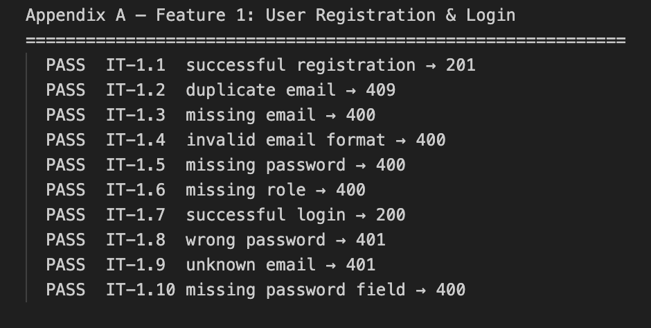

---

## Appendix B — Feature 2: Report Draft

> Screenshot of `python3 docs/run_integration_tests.py` output for the **Feature 2** section (IT-2.1 – IT-2.6).

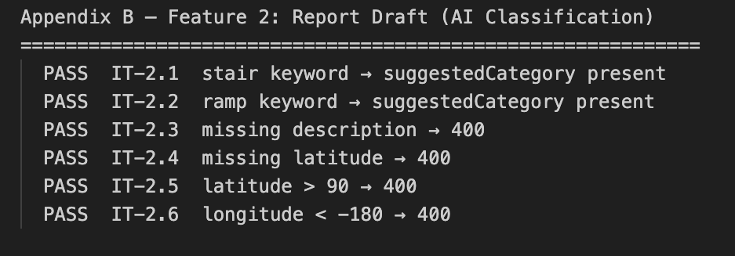

---

## Appendix C — Feature 3: Report Submission

> Screenshot of `python3 docs/run_integration_tests.py` output for the **Feature 3** section (IT-3.1 – IT-3.8).

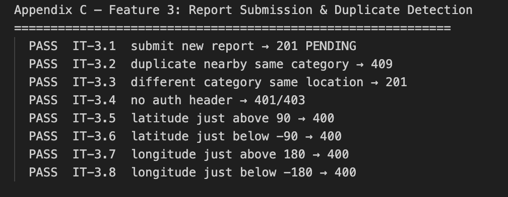

---

## Appendix D — Feature 4: View Report

> Screenshot of `python3 docs/run_integration_tests.py` output for the **Feature 4** section (IT-4.1 – IT-4.2).

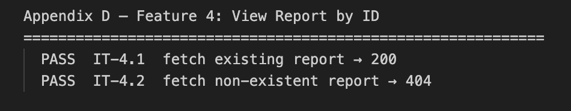

---

## Appendix E — Feature 5: Nearby Lookup

> Screenshot of `python3 docs/run_integration_tests.py` output for the **Feature 5** section (IT-5.1 – IT-5.4).

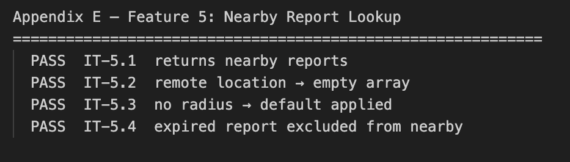

---

## Appendix F — Feature 6: Community Voting

> Screenshot of `python3 docs/run_integration_tests.py` output for the **Feature 6** section (IT-6.1 – IT-6.6).

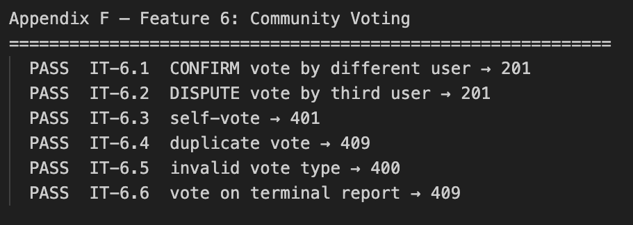

---

## Appendix G — Feature 7: Confidence Score

> Screenshot of `python3 docs/run_integration_tests.py` output for the **Feature 7** section (IT-7.1 – IT-7.2).

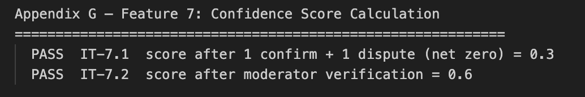

---

## Appendix H — Feature 8: Moderation

> Screenshot of `python3 docs/run_integration_tests.py` output for the **Feature 8** section (IT-8.1 – IT-8.x).

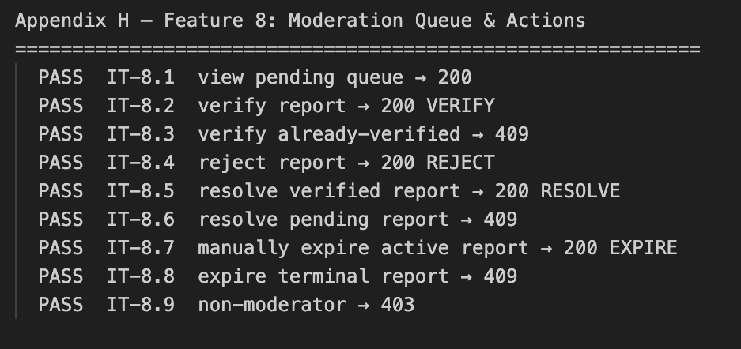

---

## Appendix I — Feature 9: Routing

> Screenshot of `python3 docs/run_integration_tests.py` output for the **Feature 9** section (IT-9.x).

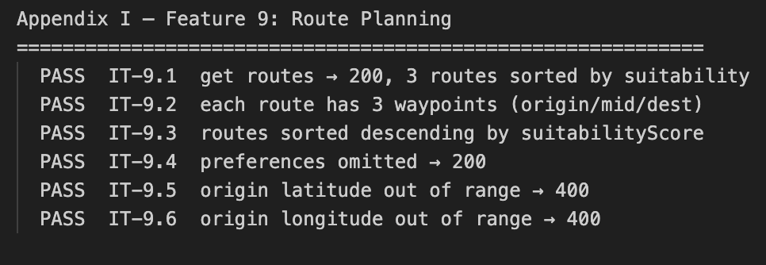

---

## Appendix J — Feature 10: JWT Authentication & Security Filters

> Screenshot of `python3 docs/run_integration_tests.py` output for the **Feature 10** section (IT-10.1 – IT-10.4).

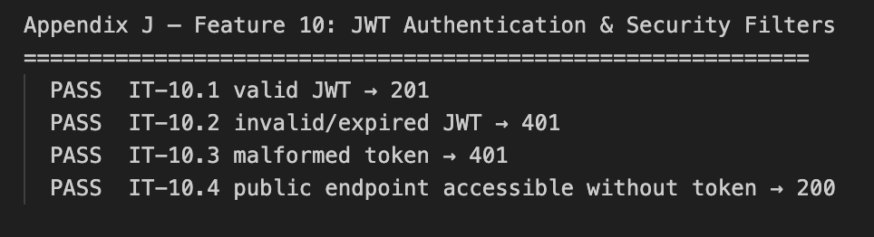

---

## Appendix K — Feature 11: Automatic Report Expiry

> Screenshot of `python3 docs/run_integration_tests.py` output for the **Feature 11** section (IT-11.1 – IT-11.4).

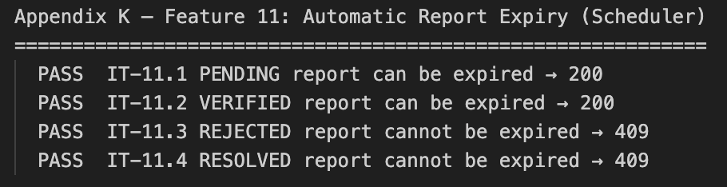

---

## Appendix L — FE-1: Login Page

> Browser screenshot of the login page (`/login`) with the form visible.


---

## Appendix M — FE-2: Register Page

> Browser screenshot of the registration page (`/register`) with email, password, and role fields visible.

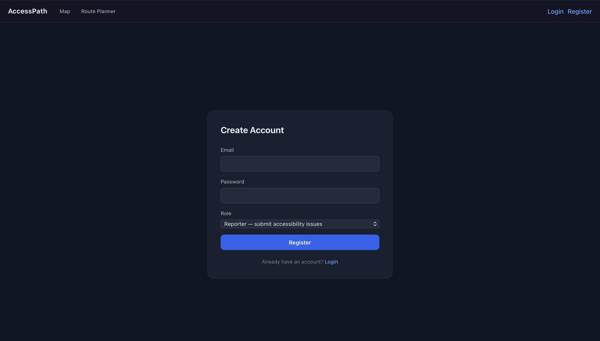

---

## Appendix N — FE-3: Map Page with Markers

> Browser screenshot of the map page (`/`) showing the Leaflet map with coloured report markers and the ReportForm sidebar panel.


---

## Appendix O — FE-4: Report Form — AI Draft Suggestion

> Browser screenshot of the ReportForm after clicking "Get AI Suggestions", showing the blue AI suggestion banner with suggested category and severity.


---

## Appendix P — FE-5: Report Form — Duplicate Warning

> Browser screenshot of the ReportForm showing the orange duplicate warning dialog when a nearby report of the same category already exists.

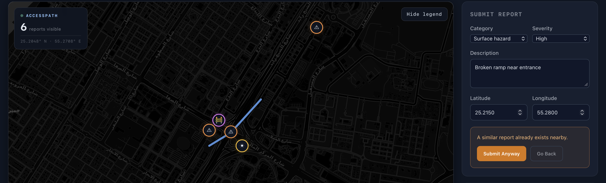

---

## Appendix Q — FE-6: Moderation Page

> Browser screenshot of the moderation queue page (`/moderation`) logged in as `modtest@test.com`, showing pending reports with action buttons.


---

## Appendix R — FE-7: Route Planning Page

> Browser screenshot of the route planning page (`/routes`) showing three ranked route options with suitability scores and any active warnings.


---

## Appendix S — FE-8: Access Denied (wrong role)

> Browser screenshot showing the "Access Denied" message when a non-MODERATOR user (e.g. `alice@test.com`) navigates to `/moderation`.

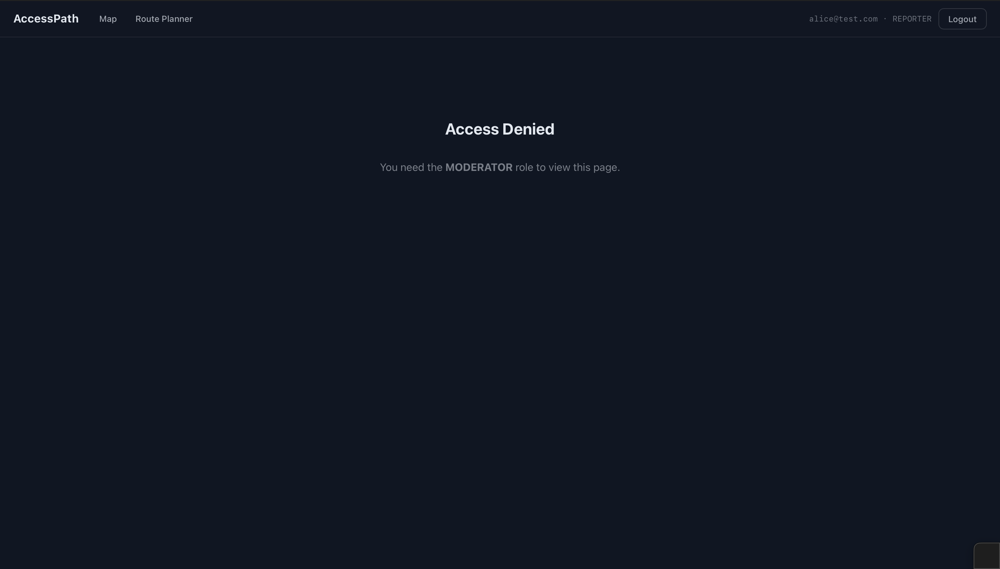

---

## Appendix T — FE-9: Login Error

> Browser screenshot of the login page showing the red error message "Invalid email or password." after submitting wrong credentials.

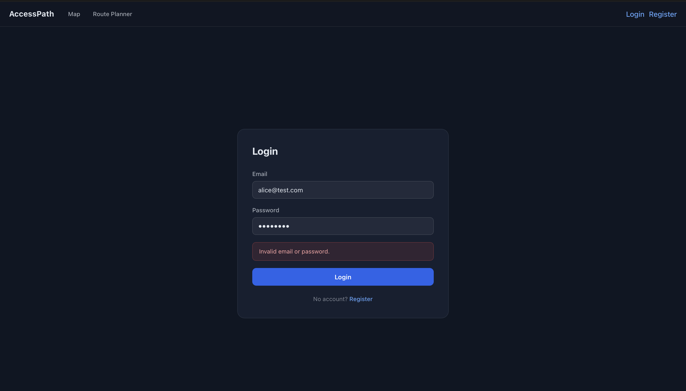

---

## Appendix U — FE-10: Register Error

> Browser screenshot of the register page showing the red error message "Registration failed. Email may already be in use." after submitting a duplicate email.

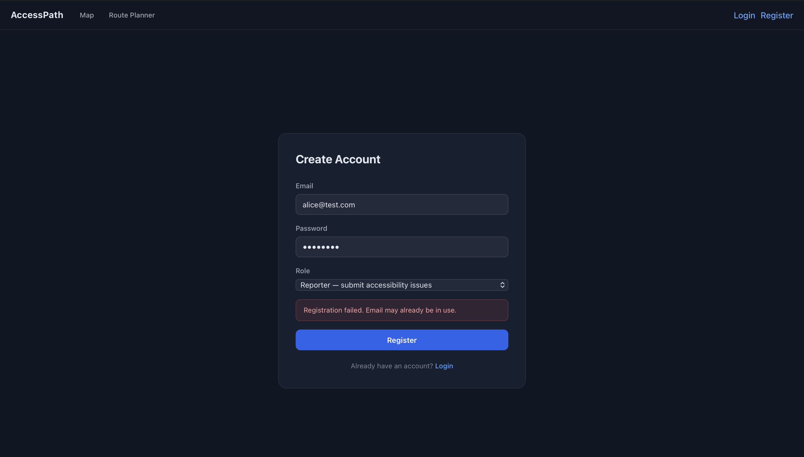

---

## Appendix V — FE-11: Report Submitted — Marker on Map

> Browser screenshot of the map page immediately after a successful report submission, showing the new marker at the submitted coordinates.

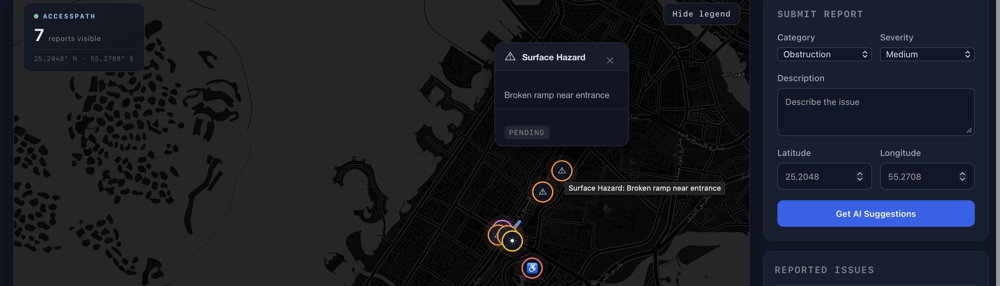

---

## Appendix W — FE-12: Vote — Confirm

> Browser screenshot of the ReportList showing the "Vote recorded" green label after clicking "✓ Confirm" on a report.

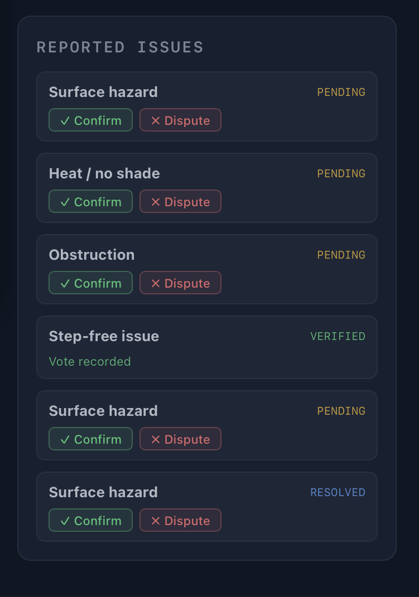

---

## Appendix X — FE-13: Vote — Already Voted Error

> Browser screenshot of the ReportList showing the "Already voted or not allowed" red label after attempting a duplicate vote.

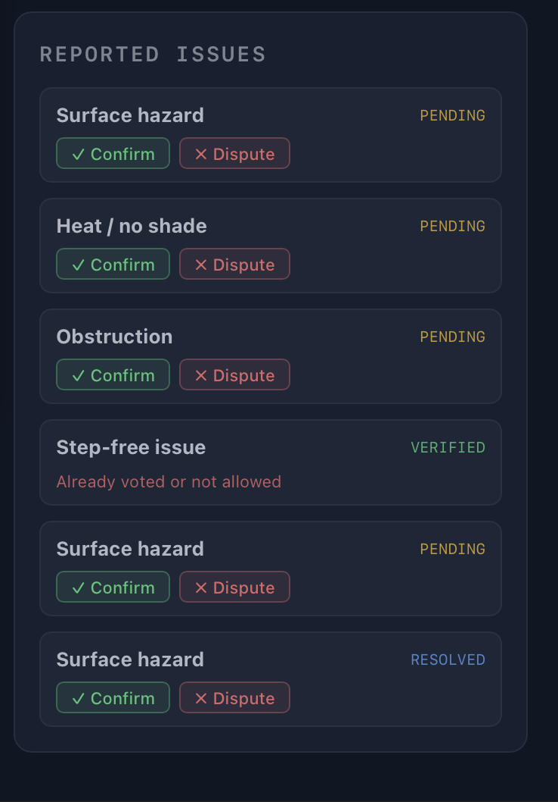

---

## Appendix Y — FE-14: Moderation Action — Verify

> Browser screenshot of the moderation page after clicking "Verify" on a PENDING report, showing the queue has refreshed and the report is no longer listed.

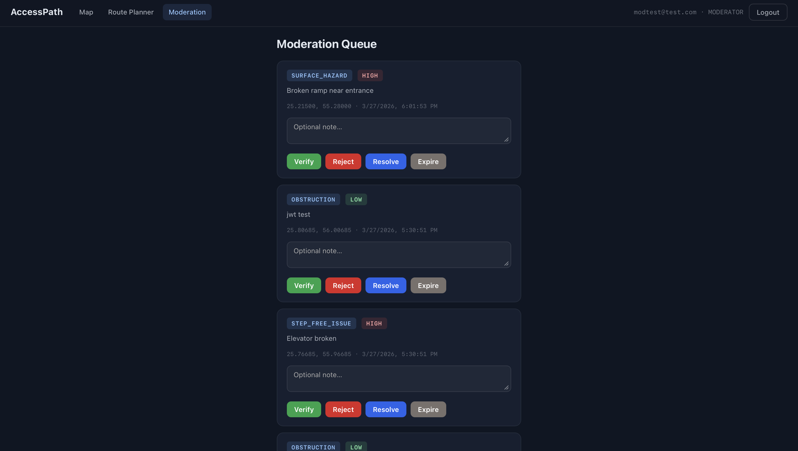

---

## Appendix Z — FE-15: Logout

> Browser screenshot showing the navbar after logout — Login and Register links visible, no email or Logout button, user redirected to `/login`.

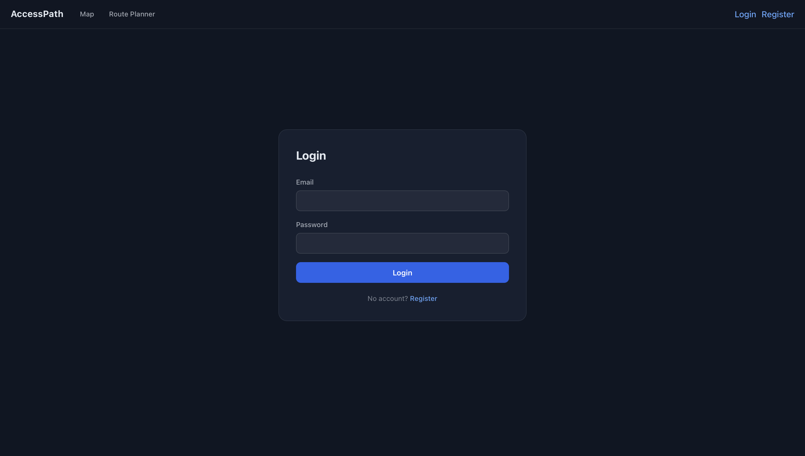

---

## Appendix AA — FE-16: Category Filter

> Browser screenshot of the map page after clicking a category filter button (e.g. "Surface hazard"), showing the active filter highlighted and only matching reports visible.

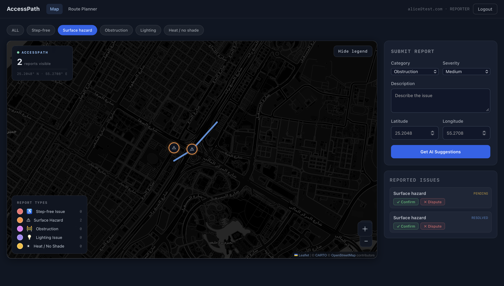

---

## Appendix AB — FE-17: Report Marker Popup

> Browser screenshot of the map page showing a popup open on a report marker, displaying the category icon, description, status badge, and timestamp.

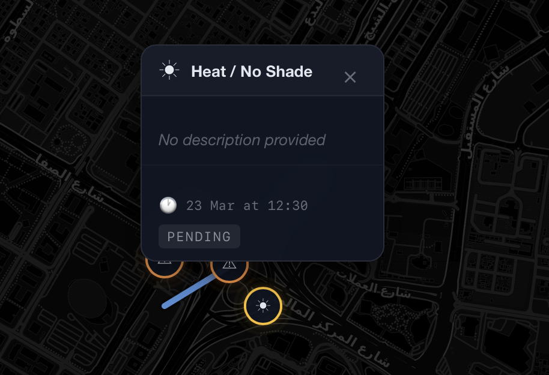

---

## Appendix AC — FE-18: Unauthenticated Redirect

> Browser screenshot showing the `/login` page after navigating directly to `/moderation` while logged out — the router redirects unauthenticated users to login.

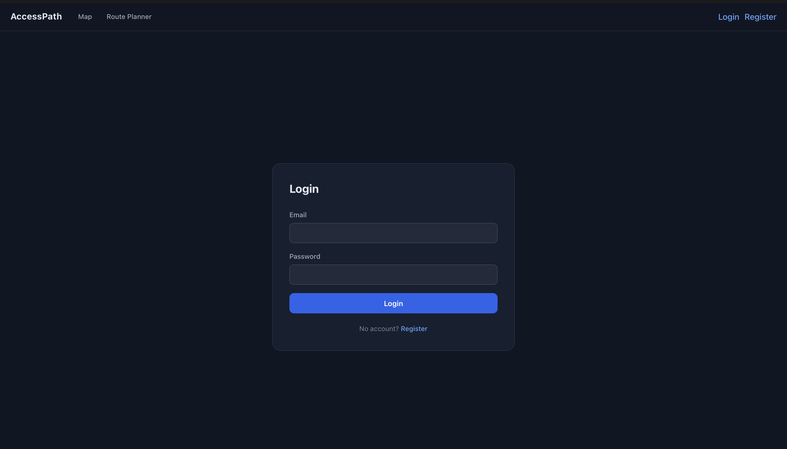

---

## Appendix AD — FE-19: Route Form Validation Error

> Browser screenshot of the route planning page showing the red error message "Please fill in all coordinates." after clicking "Find Accessible Routes" with empty fields.

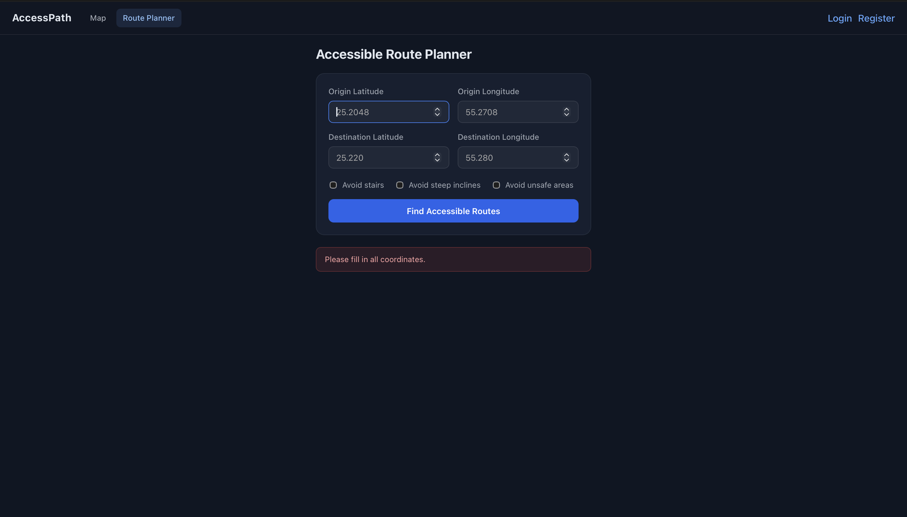

---

*End of Test Plan Document*
